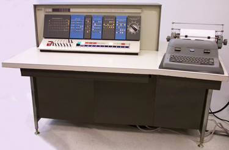
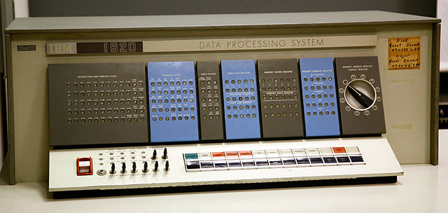
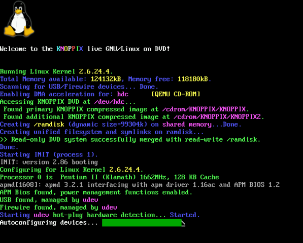
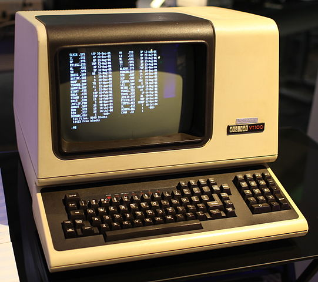
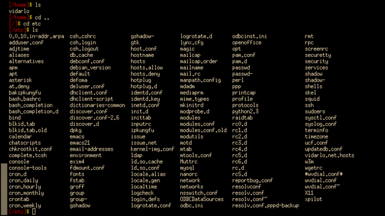
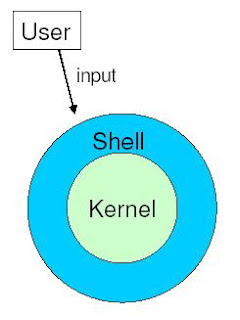
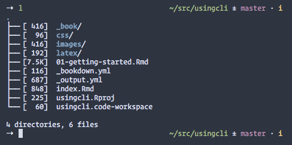

# 命令行入门

虽然如今计算机图形化界面大行其道，然而在计算机诞生之初却是命令行界面的天下。那么，什么是命令行界面呢？要说清这个问题，让我们先来谈谈 Console（控制台）、Terminal（终端）、Terminal emulator（终端模拟器）、Shell 等基本概念。

## Console（控制台）

Console 即控制台，又称为 System console（系统控制台）、Computer console（计算机控制台）、Root console（根控制台）、Operator's console（操作员控制台）。实际上，早先的控制台是一种用来操作计算机的硬件，如图 \@ref(fig:ibm-1620-model-1) 所示。^[该图引自 [Wikipedia](https://en.wikipedia.org/wiki/System_console#/media/File:IBM_1620_Model_1.jpg)]在该图中我们可以看到，IBM 1620 计算机的控制台由左边的操作前面板（参见图 \@ref(fig:ibm-1620-model-1-front-panel)）和右边的打字机组成。通过控制台，操作员完成将文本或指令录入到计算机的工作，最终并回显出结果。

```{r ibm-1620-model-1, echo=FALSE, fig.cap='IBM 1620 的控制台'}

```

```{r ibm-1620-model-1-front-panel, echo=FALSE, fig.cap='IBM 1620 的操作前面板'}

```

随着计算机的发展，控制台从硬件概念变成了一个软件概念。所以控制台也有了新的称法：虚拟控制台，正好与实打实的控制台硬件相对。当 Linux 系统启动时，经过计算机硬件自检画面之后的过程就进入了系统控制台。在该过程中，通常会显示 Linux 系统引导的信息，如图 \@ref(fig:linux-booting) 所示。

```{r linux-booting, echo=FALSE, fig.cap='Linux 系统控制台'}

```

```{block2, type='rmdtip'}
在 Linux 桌面环境中要进入虚拟控制台，可以按 Ctrl + Alt + F1 ... F6 组合键。再次按下 Ctrl + Alt + F7 则又回到桌面。
```

## Terminal（终端）

跟控制台一样，起初的 Terminal（终端）也是一种计算机硬件设备，类似我们今天看到的显示器和键盘的结合体。利用终端，用户将数据输入到计算机。同时，终端也将计算机中的数据展示给用户。图 \@ref(fig:dec-vt100) 为曾经广泛流行的终端 DEC VT100。^[该图引自 [Wikipedia](https://en.wikipedia.org/wiki/Computer_terminal#/media/File:DEC_VT100_terminal.jpg)]

```{r dec-vt100, echo=FALSE, fig.cap='DEC VT100 终端'}

```

为什么会出现终端这种设备？以今天的眼光看似乎显得不可理解。早期的计算机十分昂贵，可不像现在人人都能拥有一台。除了大型商业组织或大学，很难在别处看到计算机的身影。为了共享计算机资源，终端应运而生。伴随着科技的进步，终端虽然最终掉进了历史的黑洞，然而却以新的形式重生，这就是 Terminal emulator（终端模拟器），或称之为虚拟终端。

## Terminal emulator（终端模拟器） {#term}

Terminal emulator 意为终端模拟器，即用来模拟终端硬件设备的应用程序。某些显示体系结构，像是用来控制色彩的转义序列、光标位置等在终端模拟器中得到了支持。图 \@ref(fig:xterm) 显示 Linux 中流行的终端程序之一 xterm。

```{r xterm, echo=FALSE, fig.cap='xterm 终端程序'}

```

不管是 Linux，还是 macOS，乃至 Windows 操作系统平台，都有许多终端模拟器可以选择。

### Linux

- xterm：X11 环境的默认终端。
- gnome-terminal：GNOME 桌面环境的默认终端。
- konsole：KDE 桌面环境的默认终端。
- xfce4-terminal：Xfce 桌面环境的默认终端。
- rxvt-unicode：克隆自 rxvt，但加入了 unicode 支持，具有很强的定制特性。本书作者使用的就是这款终端。

### macOS

- Terminal：macOS 操作系统默认的终端。
- iTerm2：非常流行的开源终端。

### Windows

- mintty：Cygwin 环境的终端。
- PuTTY：支持多种协议的开源终端。

终端模拟器究竟有什么用呢？这就是我们将在下一节要介绍的内容——Shell。

## Shell

在 Linux 中，Shell 是一种命令解释程序，它负责用户输入命令的解析和执行。现代 Shell 除了具有与用户直接交互的特性之外，通常也包含编程功能，支持变量、数组、函数、循环、条件等要素。

Shell 之所以被称为 Shell，是由于它相对 Linux 的核心——内核而言，处于最外层，就像乌龟的壳一样。也正因为如此，Shell 提供用来访问系统服务的用户界面，扮演着与内核交互的角色，如图 \@ref(fig:shell) 所示。

```{r shell, echo=FALSE, fig.cap='Shell 与内核'}

```

在 Unix 及 Linux 的发展过程中，出现了多种 Shell，其中比较知名的包括：sh、csh、ksh、bash、zsh 等。

### sh {#sh}

sh，即 Bourne shell，为 Unix 第 7 版的默认 Shell。Bourne shell 由贝尔实验室的 Stephen Bourne 开发，于 1979 年发布。随着《Unix 编程环境》（Brian Kernighan 与 Rob Pike 著）一书的出版，sh 变得大为流行。

现在 Linux 系统中的 sh 通常是符号链接的某个兼容 Shell。例如，作者所用的 Debian 9 里的 sh 为 dash。

```bash
root@toydroid:~# ls -l /bin/sh
lrwxrwxrwx 1 root root 4 Jan 24  2017 /bin/sh -> dash
```

在作者的另一个系统 Arch Linux 中，sh 为 bash。

```bash
root@codeland:~# ls -l /bin/sh
lrwxrwxrwx 1 root root 4 Feb  7 15:15 /bin/sh -> bash*
```

### csh

csh 是 C shell 的简称，它由 Bill Joy 开发，通过 BSD 得到了广泛的分发。在风格上，开发者将 csh 设计得像 C 编程语言一样，因而由此得名。同时，使它具有更佳的交互使用体验。后来被其它 Shell 吸收的诸如历史、别名、目录栈、文件名补全、作业控制等特性均出自 csh。

csh 有一个改进版本叫 tcsh，目前是 FreeBSD 的默认 Shell。

### ksh

ksh 指 KornShell，其开发者为 David Korn，在 1983 年公布于世。ksh 遵循 POSIX 标准，能够向下兼容 Bourne shell，整合了来自 C shell 的诸多特性。ksh 的一大亮点是引入了 vi 和 Emacs 风格的命令行编辑模式，使用户完全可以按照自己的按键习惯操作。此外，在 ksh 中还增加了关联数组的特性。

由于 ksh 最初以私有软件的形式进行分发，从而被限制了传播。代之以出现的替代品包括 pdksh（public domain ksh，公有域的 ksh）、mksh（后成为 Android 的默认 Shell）等。

### bash

bash 作为理查德·斯托曼 GNU 工程的一部分出现，从它诞生之初就是为了用来取代 Bourne shell（参考 \@ref(sh) 节）。Brian Fox 开发了 bash，首个版本发布于 1989 年。如今，bash 已变得十分流行，它是大多数 Linux 发行版以及 macOS 的默认 Shell。此外，通过 WSL（Windows Subsystem for Linux），在 Windows 10 中也可以安装并使用 bash。

bash 的名称来自于 **B**ourne-**a**gain **sh**ell，它也遵循 POSIX 标准，其特性吸收自 sh、csh、ksh 等多种 Shell。

### zsh

zsh 是 Z shell 的简称，最初的版本由 Paul Falstad 所开发，发布于 1990 年。zsh 极大的扩展了 Bourne shell 的功能，并包含来自 tcsh、ksh、bash 等 Shell 的特性。

在交互用户体验上，zsh 尤其出彩。比如，它支持对命令的选项进行补全、可以设置右提示符等，如图 \@ref(fig:zsh-prompt) 所示。

```{r zsh-prompt, echo=FALSE, fig.cap='zsh 的右提示符'}

```

## 命令行界面

所谓命令行界面也就是 Command-line interface，经常缩写为 CLI，亦即用户输入命令的地方。一旦用户将命令输入完毕并加以提交后，后续对命令的解析以及执行的任务都由 Shell 来完成。

```{block2, type='rmdnote'}
与 CLI 相对的是 GUI，即 Graphical user interface，意为图形用户界面，它采用图形化的方式让用户与计算机进行交互。因其具有容易使用的优点，包括 Linux、macOS、Windows 等在内的现代操作系统无一例外都提供了图形用户界面。
```

通过前面的讨论现在我们可以知晓，我们想要输入命令的界面由 Shell 提供，而执行 Shell 则有两种方法。

### 通过控制台进入命令行

为了节省系统资源，Linux 服务器通常没有图形用户界面。当它启动完毕时，在控制台按照提示输入用户帐号及密码并登录后，所进入的即是命令行界面。

作为普通用户来说，一般使用的是具有图形用户界面的 Linux 桌面系统。在它启动后就直接进入了桌面，那么此时想要进入控制台，则可以按下列步骤执行：

1. 按 Ctrl + Alt + F1 组合键，进入编号为 1 的控制台。

2. 按 Ctrl + Alt + F2 组合键，进入编号为 2 的控制台。

3. 依次类推，可以分别进入 3、4、5、6 控制台。在默认情况下，Linux 一般提供 6 个控制台。

4. 要返回桌面，则可以按 Ctrl + Alt + F7。

### 通过终端进入命令行

另外一种进入命令行界面的方法是使用终端。在不同的操作系统中，可以选择的终端程序也有所不同（参考 \@ref(term) 节）。本书作者在 Linux 下常用 rxvt-unicode，macOS 中则使用 iTerm。

一般而言，终端程序会跟系统的登录 Shell（或称默认 Shell）绑定在一起。有些终端程序提供了更改 Shell 的特性，从而使用户可以方便的选择自己喜欢的 Shell。如果不能从终端程序中直接更改 Shell，那么也可以通过 `chsh` 命令来改变登录 Shell。假如我们想把默认 Shell 更改成 zsh，则可以执行以下命令：

```bash
xiaodong@codeland:~$ chsh -s /bin/zsh
```

```{block2, type='rmdtip'}
怎么判断当前所用的 Shell 是哪一种呢？只需执行 `echo $SHELL` 即可。
```

## 你好，命令行

在《C 程序设计语言》中，作者 Brian W. Kernighan 和 Dennis M. Ritchie 介绍的第一个程序是在屏幕上输出一行“Hello world”的消息。为了说明命令行的使用，我们也将在屏幕上输出类似的消息——你好，命令行。

当我们进入控制台或打开终端时，通常会看到跟图 \@ref(fig:cil-prompt) 相似的界面。从该图中我们可以看到命令行由下面几部分组成：

1. 当前登录的用户名称。

2. 主机名，跟 `hostname -s` 的输出一致。

3. 当前工作目录，`~` 代表用户的主目录，在 Linux 系统下也就是 `/home/<用户名>`，macOS 中则为 `/Users/<用户名>`。

4. 命令提示符。普通用户的命令行提示符通常与超级用户的不同，以 bash 为例，root 用户的命令行提示符为 `#`。

5. 待执行的命令，除命令本身外，可能也包括该命令的选项以及参数等部分。
