# 神奇补全

如果你编写过代码，那么一定听说过“代码补全”吧。在如今流行的代码编辑器和 IDE (集成开发环境) 中，这绝对是一项深受大家喜欢的功能。在此我要讲的 Shell 补全与它很相似。我相信，在学习了本章所讲的内容后，你肯定会爱上它。首先，我们会谈谈什么叫自动补全，然后看看如何触发自动补全，接着详细探讨诸如文件名或路径名、程序名或命令名、用户名、主机名、以及变量名等各种自动补全类型，最后再介绍可编程补全。

## 何谓补全

现在回过头来看，在学习命令行时，我最想率先学习的功能一定是自动补全。为什么这么说呢？因为自动补全这项功能让我们只需输入开头的一个或几个字符便能通过 Shell 自动补全剩下的内容。对于痛恨输入长命令或文件名的朋友而言，自动补全绝对是福音。自动补全不仅减少了输入，而且节省了时间，从而极大的提高了我们的操作效率。

让我们通过一个例子来说明何谓自动补全。首先，我通过在 bash 中直接输入完整的命令行

```bash
xiaodong@codeland:~$ ls -l reallylongname.txt
```

来查看 `reallylongname.txt` 这个文本文件的信息。

然后，我在输入

```bash
xiaodong@codeland:~$ ls -l r
```

之后按 **Tab 键**，于是 bash 帮我自动补全了该文件名剩下的部分。

```bash
xiaodong@codeland:~$ ls -l reallylongname.txt
```

比较两次输入，bash 帮我少输了 17 个字符。是不是感觉很爽呢？

再看一个例子：这次，我在输入

```bash
xiaodong@codeland:~$ ls -l f
```

后按 **Tab**，bash 自动补全了 `file`。

```bash
xiaodong@codeland:~$ ls -l file
```

接着，我连按两下 **Tab**，这时 bash 向我们展示了可以自动补全的文件名列表，总共包括 5 个项目。

```bash
xiaodong@codeland:~$ ls -l file
file1  file2  file3  file4  file5
```

我输入 `1` 来完成 bash 自动补全过程。

比较这两个例子，我们可以发现，如果我们输入的开头字符唯一，那么 bash 将直接自动补全余下的内容。反之，则提供一个可供补全的备选列表。不过，这时候需要我们连按两下 **Tab 键**。这样的话，经常操作起来感觉还是有点麻烦。

下面我们对 bash 自动补全的配置进行一番优化，使之更加好用。利用文本编辑器打开 `~/.inputrc` 文件 (若不存在，则创建一个)，加入下列内容：

```bash
# completion
set show-all-if-ambiguous on
set visible-stats on
set colored-completion-prefix on
```

其中，开启 `show-all-if-ambiguous` 这个选项后，我们只需按一次 **Tab** 即可看到备选补全列表；`visible-stats` 选项通过在列表项目尾部添加指示符号来说明类型，例如：`@` 代表符号链接、`/` 代表目录等；最后的 `colored-completion-prefix` 选项则给补全的前缀字符加上颜色。如图 \@ref(fig:bash-comp-conf) 所示。

```{r bash-comp-conf, echo=FALSE, fig.cap='bash 自动补全配置结果'}
knitr::include_graphics('images/bash-comp-conf.png')
```

## 补全触发按键

通过这些例子，我们也可以知道，要触发自动补全，一般只要按 **Tab 键**即可。bash 和 zsh 都是这个默认设定。

## 文件名、路径名补全

前面的例子显示的是在 bash 中文件名自动补全的情况。下面我们看一个在 zsh 中自动补全文件名的例子。当我输入

```bash
xiaodong@codeland:~$ ls -l f
```

后按 **Tab**，zsh 为我自动补全了 `file`。

```bash
xiaodong@codeland:~$ ls -l file
```

我接着再按 **Tab 键**，这时 zsh 提供了可以备选的自动补全菜单。

```bash
xiaodong@codeland:~$ ls -l file
file1  file2  file3  file4  file5
```

再次按 **Tab** 则可以选择具体的菜单项目。

```bash
xiaodong@codeland:~$ ls -l file2
file1  **file2**  file3  file4  file5
```

然后按**回车键**完成自动补全过程。

```bash
xiaodong@codeland:~$ ls -l file2
```

最后再按一次**回车键**执行命令。

不知大家有没有发现与 bash 补全的区别呢？bash 提供的备选补全列表不能选择具体的项目，而 zsh 则可以。这也说明与 bash 相比，zsh 具有更棒的用户交互功能。所以我平常也更喜欢使用 zsh 一些。如果你还没有用过 zsh，那么我在此建议你一定要试一试。

说到备选补全列表，在 bash 中我喜欢使用的一组快捷键是 **Alt + ?**。当 bash 补全 `file` 后，我没有按 **Tab**，而是按 **Alt + ?**，bash 就立即呈现了备选补全列表。

```bash
xiaodong@codeland:~$ ls -l file
file1  file2  file3  file4  file5
```

还有一种情况，有时候我们希望 Shell 不要补全某些特别的文件类型。为了达到这种效果，我们可以使用 `FIGNORE` 变量。在下面的例子中，我想查看 `Welcome.java` 的内容，因此只想 Shell 补全 `.java` 文件，并排除 `.class` 文件。

```bash
xiaodong@codeland:~$ cat W
Welcome.class  Welcome.java
xiaodong@codeland:~$ cat Welcome.
```

在将 `.class` 扩展名赋给 `FIGNORE` 变量后，Shell 就为我剔除掉了 `.class` 文件类型。

```bash
xiaodong@codeland:~$ FIGNORE='.class'
xiaodong@codeland:~$ cat W<Tab>
xiaodong@codeland:~$ cat Welcome.java
```

如果想要排除多种文件类型，则只需用 `:` (冒号) 分隔即可。例如：

```bash
xiaodong@codeland:~$ FIGNORE='.o:.class'
```

这将让 Shell 在自动补全时排除 `.o` 和 `.class` 文件。无论是 bash，还是 zsh，当前都支持 `FIGNORE`。

路径名补全和文件名补全很相似，只是在补全后自动追加上 `/` (斜杠)，便于我们输入下一级的路径名。在下例中，我在输入

```bash
xiaodong@codeland:~$ cd g
```

后按 **Tab**，Shell 补完了全名，并在其后添加了一个 `/`。

```bash
xiaodong@codeland:~$ cd guessing_game/
```

之后我接着输入 `s` 并按 **Tab**，这次 Shell 补全了下级目录 `src`。

```bash
xiaodong@codeland:~$ cd guessing_game/src/
```

对于开头字符不唯一的情况，跟文件名补全也是一样，bash 中只要按 **Tab** 即可看到备选补全列表。

```bash
xiaodong@codeland:~$ cd h
hello/       hello_world/
xiaodong@codeland:~$ cd hello
```

顺便提一句，自动补全不光在命令行下使用，即便在有些图形化程序中也能使用。比如，在 GIMP 中，我也可以通过自动补全来打开文件。如图 \@ref(fig:gimp-comp) 所示。

```{r gimp-comp, echo=FALSE, fig.cap='在 GIMP 中自动补全文件名'}
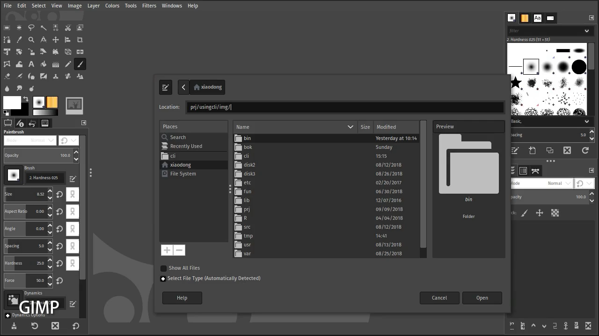
```

## 程序名、命令名补全

不带选项的程序名、命令名补全几乎跟文件名补全一样，让我们来看一个例子。要是你看过《黑客帝国》这部电影，那么下面的画面你应该会很熟悉。当我输入

```bash
xiaodong@codeland:~$ cmat
```

后按 **Tab**，bash 立即为我自动补全了 `cmatrix` 命令。

```bash
xiaodong@codeland:~$ cmatrix
```

而当我在输入

```bash
xiaodong@codeland:~$ cma
```

后按 **Tab**，bash 为我提供了一个备选补全列表。

```bash
xiaodong@codeland:~$ cma
cmake        cmake-gui    cmapcube     cmark        cmark-gfm    cmatrix
```

此时，需要再输入 `t` 才能完成补全。

```bash
xiaodong@codeland:~$ cmat
```

如果我在仅仅输入 `c` (命令开头的第一个字符)

```bash
xiaodong@codeland:~$ c
```

后便按 **Tab**，这时 bash 询问我：“Display all 474 possibilities? (y or n)” (是否显示所有 474 个补全列表项目) 按 **y** 予以显示。按 **n** 则不显示。

```bash
xiaodong@codeland:~$ c
Display all 474 possibilities? (y or n)
```

因为可供自动补全的列表项目太多，一屏已经显示不下了，所以 bash 使用 `more` 这个页面查看程序来呈现。现在按 **Space (空格键)** 可以翻页，如果想退出，那么按 **q** 即可。如图 \@ref(fig:cmd-comp-more) 所示。

```{r cmd-comp-more, echo=FALSE, fig.cap='命令自动补全备选列表'}
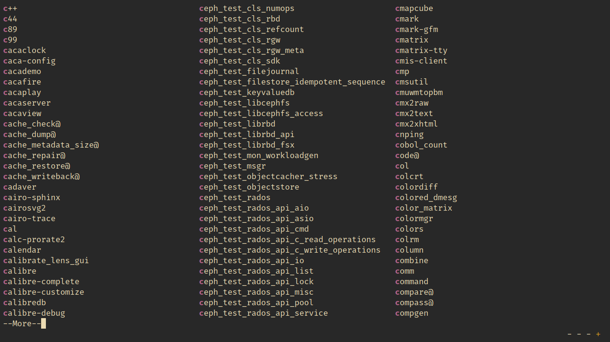
```

除了直接补全命令名之外，Shell 也能自动补全程序的子命令，例如：`git status` 中的 `status` 以及命令的选项。不过，bash 需要安装一个单独的 `bash-completion` 包；而 zsh 因为内置了对此功能的支持，所以不需要额外的包。

[bash-completion 的源代码](https://github.com/scop/bash-completion)位于 GitHub 上，在此可以了解如何对其安装和配置。例如：

在 Debian 中，我们可以通过执行

```bash
xiaodong@codeland:~# apt install bash-completion
```

来安装它。

在 CentOS 上，除了安装 `bash-completion` 外，我推荐把 `bash-completion-extras` 也装上。

```bash
xiaodong@codeland:~# yum install bash-completion bash-completion-extras
```

而在 Arch Linux 上，则可以执行

```bash
xiaodong@codeland:~# pacman -S bash-completion
```

进行安装。

要配置 `bash-completion`，则只需要将下面这行指令加入 `~/.bashrc` (个人) 或 `/etc/bash.bashrc` (全局) 即可。

```bash
[ -r /usr/share/bash-completion/bash_completion ] \
&& . /usr/share/bash-completion/bash_completion
```

在正常使用 zsh 的命令补全功能之前，我们也需要将下列内容加入到 `~/.zshrc` 配置文件中：

```bash
# completion
autoload -U compinit
compinit -i
```

让我们先来看一个自动补全命令选项的例子。我在输入

```bash
xiaodong@codeland:~$ find -
```

后便立即按 **Tab**，bash 马上列出了可以自动补全的选项列表。如图 \@ref(fig:subcmd-comp) 所示。

```{r subcmd-comp, echo=FALSE, fig.cap='命令选项自动补全备选列表'}
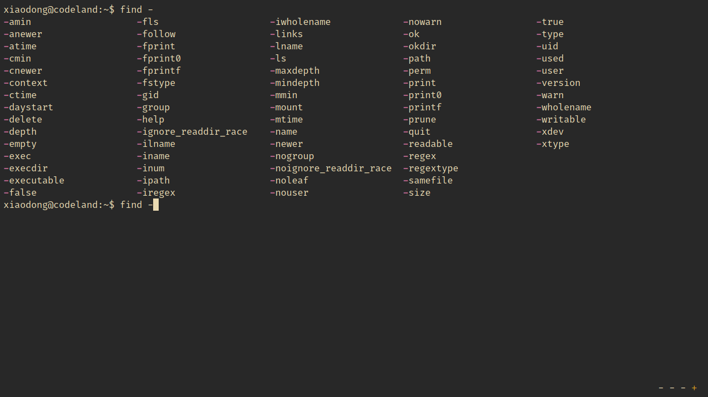
```

我接着输入 `ina`

```bash
xiaodong@codeland:~$ find -ina
```

并再次按下 **Tab**，此时 bash 自动补全了 `-iname` 选项。

```bash
xiaodong@codeland:~$ find -iname
```

下面的例子演示了 bash 补全子命令的情形。在输入

```bash
xiaodong@codeland:~$ git in
```

后，按 **Tab**，bash 提供可以自动补全的子命令列表。

```bash
xiaodong@codeland:~$ git in
info       init       instaweb
```

跟着输入 `i`

```bash
xiaodong@codeland:~$ git ini
```

并再按 **Tab**，这次 bash 便自动补全了子命令 `init`。对于执行 `git status` 子命令的过程同样如此。

```bash
xiaodong@codeland:~$ git init
```

与 bash 比较而言，zsh 对于命令选项的补全提供更好的用户体验。在下面的例子中，你将看到，zsh 不仅列出了可供补全的选项列表，更有对该选项用途的解释。如图 \@ref(fig:zsh-cmd-opt-comp) 所示。此外，正如前面提到的，你还可以选择这些列表项目。

```{r zsh-cmd-opt-comp, echo=FALSE, fig.cap='zsh 中的命令选项自动补全'}
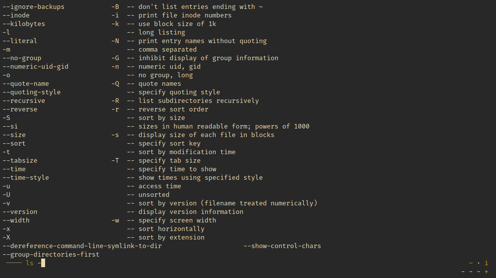
```

对于子命令的补全，zsh 提供与命令选项补全相同的效果。

此外，子命令以及选项补全也可以合用。在下例中，我先补全了子命令 `git status`，然后又补全了选项 `--verbose`。

```bash
xiaodong@codeland:~$ git sta
stash  -- stash away changes to dirty working directory
status -- show working-tree status
xiaodong@codeland:~$ git status --v
xiaodong@codeland:~$ git status --verbose
```

### Zsh 自动建议插件

对于使用 zsh 的朋友，我在此推荐一个好用的命令自动建议插件。这个插件叫做 [zsh-autosuggestions](https://github.com/zsh-users/zsh-autosuggestions)。针对命令进行自动建议这项功能源自于 `fish` shell，现在，zsh 从其借鉴过来，使得我们这些 zsh 的忠实拥趸也能使用这项好功能。

zsh-autosuggestions 的安装很简单，只需从 GitHub 将其克隆到本机，然后在 `.zshrc` 中引用 `zsh-autosuggestions.zsh` 并重新打开终端即可。

```bash
xiaodong@codeland:~$ git clone \
https://github.com/zsh-users/zsh-autosuggestions.git \
~/.zsh-autosuggestions
xiaodong@codeland:~$ echo source \
~/.zsh-autosuggestions/zsh-autosuggestions.zsh \
>> ~/.zshrc
xiaodong@codeland:~$ source ~/.zshrc
```

下面让我们来看看 `zsh-autosuggestions` 的用法，首先我在没有开启 `zsh-autosuggestions` 插件的情况下输入 `ls -l`、`cd hello_world` 等命令，除了能够使用命令补全之外，这儿没有命令的自动建议。当 `zsh-autosuggestions` 插件开启后，我一旦输入 `ls`，其后便会出现灰色的自动建议 `-la`。这是因为 zsh 知道我先前曾输入过 `ls -la` 这条命令，所以它给出了自动建议。如图 \@ref(fig:zsh-autosug) 所示。

```{r zsh-autosug, echo=FALSE, fig.cap='zsh 中的命令自动建议'}
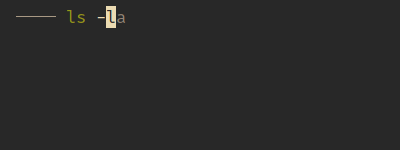
```

这时，我们有两种选择：一是按 **→ (右方向箭)** 接受建议，二是继续输入新的内容，这样也就放弃建议了。对于输入 `cd h` 后，zsh 同样给出了自动建议 `ello_world`。

## 用户名、主机名及变量名补全

除了常见的文件名、命令名补全外，Shell 自动补全还支持其它补全类型。这充分展现了 Shell 自动补全多才多艺的一面。下面我们就来看一看 Shell 如何自动补全用户名。

当我输入

```bash
xiaodong@codeland:~$ ls ~
```

之后按 **Tab**，此时 bash 为我呈现了系统中存在的用户名列表。如图 \@ref(fig:user-comp) 所示。

```{r user-comp, echo=FALSE, fig.cap='bash 中的用户名自动补全备选列表'}
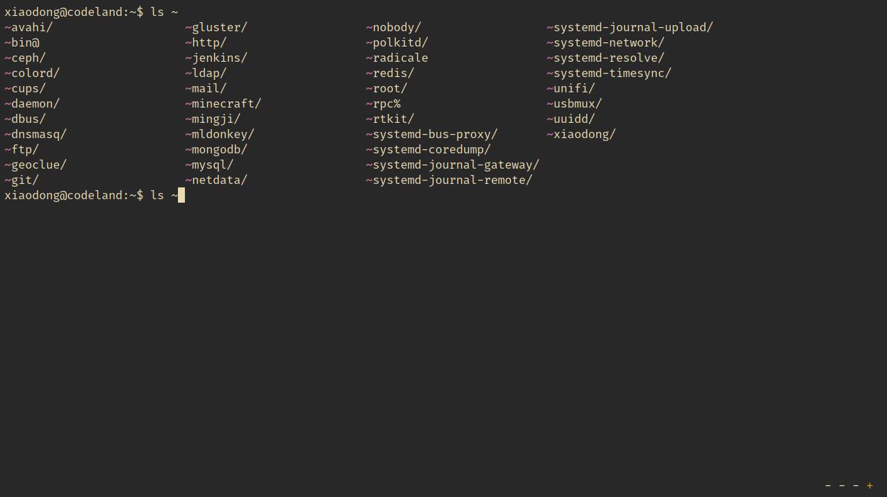
```

我继续输入 `x` 并再次按 **Tab**，于是 bash 补全了 `xiaodong` 这个用户名。

```bash
xiaodong@codeland:~$ ls ~x<Tab>
xiaodong@codeland:~$ ls ~xiaodong/
```

在 zsh 中，我们可以看到，与 bash 相比，提供的补全用户名列表表现形式略有差异。bash 中包含 `~` 前缀，并在结尾带有 `/` (斜杠)。zsh 中则仅有用户名本身。如图 \@ref(fig:zsh-user-comp) 所示。

```{r zsh-user-comp, echo=FALSE, fig.cap='zsh 中的用户名自动补全备选列表'}
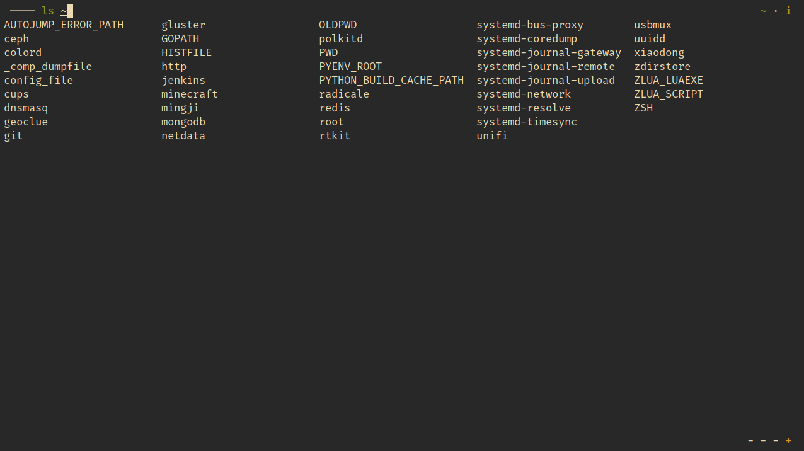
```

如果你经常使用 `ssh` 登录远程机器的话，那么主机名自动补全将助你一臂之力。同样，我们先来看一个例子。我在输入

```bash
xiaodong@codeland:~$ ssh xiaodong@l
```

后按 **Tab**，这时 bash 展示了可以自动补全的主机名列表。

```bash
xiaodong@codeland:~$ ssh xiaodong@l
xiaodong@lab.github.com         xiaodong@localhost
xiaodong@linuxtoy.org           xiaodong@localhost.localdomain
xiaodong@codeland:~$ ssh xiaodong@l
```

我接着输入 `i` 并按 **Tab**，这次 bash 就自动补全了完整的主机名 `linuxtoy.org`。你也可以直接在 `@` 后按 **Tab**，这样的话就会显示全部主机名了。

```bash
xiaodong@codeland:~$ ssh xiaodong@li<Tab>
xiaodong@codeland:~$ ssh xiaodong@linuxtoy.org
```

不仅是主机名，而且 IP 地址也同样支持自动补全。另一种情况是，直接在输入 `ssh l` 后按 **Tab**，bash 也能对主机名进行自动补全。

```bash
xiaodong@codeland:~$ ssh l
lab.github.com         linuxtoy.org           localhost
```

看到这里，你或许会想，bash 从哪里找到这些可以用来自动补全的主机名呢？一个是 `/etc/hosts` 文件的内容，另一个是 `ssh` 的配置文件，比如 `~/.ssh/config`。如图 \@ref(fig:completion-hostname) 所示。所以，如果你打算让 bash 为你自动补全常用的主机名的话，那么不妨考虑将其添加到这两个文件中。此外，还包括 `~/.ssh/known_hosts` 文件。凡是通过 `ssh` 登录过的主机，便会包含其中。

```{r completion-hostname, echo=FALSE, fig.cap='自动补全的主机名来源'}
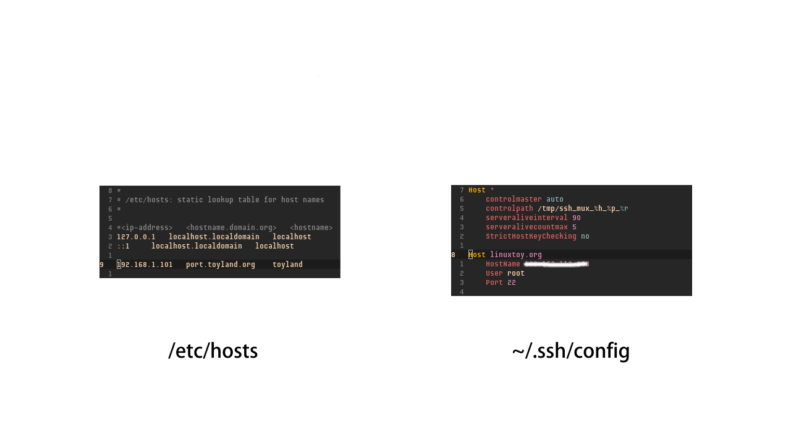
```

zsh 对主机名的自动补全与 bash 类似，此不赘述。

最后，让我们来看看对变量名的自动补全情况。当我输入

```bash
xiaodong@codeland:~$ echo $
```

后按 **Tab** 并根据提示按 **y**，这时 bash 显示了全部可供补全的变量名。如图 \@ref(fig:var-comp) 所示。

```{r var-comp, echo=FALSE, fig.cap='bash 中的变量名自动补全备选列表'}
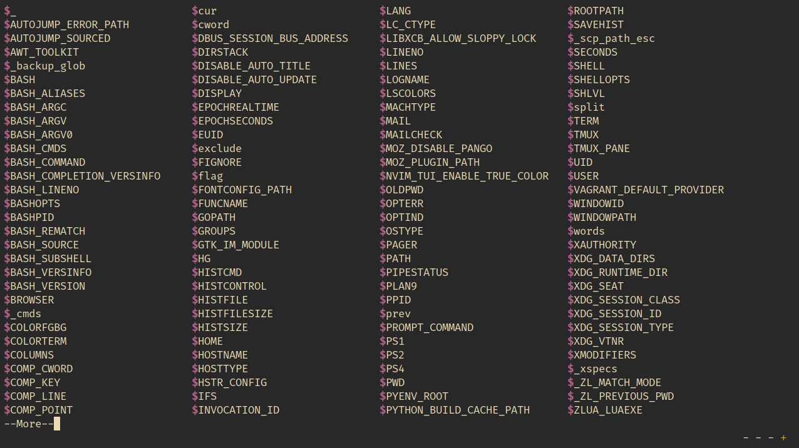
```

然后，我继续输入并搭配 **Tab** 按键，从而补全了变量 `BASH_VERSION`。

```bash
xiaodong@codeland:~$ echo $BASH_VERSION
```

zsh 对变量的自动补全与 bash 相似，不过，在我的系统上比 bash 提供的补全列表更多一些。如图 \@ref(fig:zsh-var-comp) 所示。

```{r zsh-var-comp, echo=FALSE, fig.cap='zsh 中的变量名自动补全备选列表'}
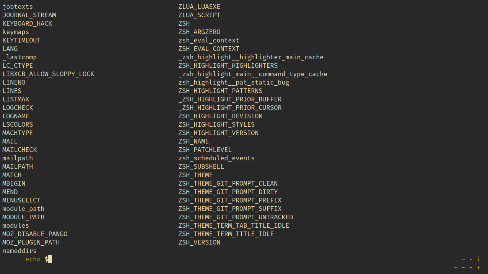
```

综合来看，这几种补全类型跟前面我们所讲的文件名、命令名自动补全还是有一点差异，那就是它们带着一个特殊的前缀字符，参考表 \@ref(tab:auto-comp-table)。

Table: (\#tab:auto-comp-table) 用户名、主机名及变量名自动补全前缀字符

| 前缀字符 | 自动补全类型 |
| -------- | ------------ |
| ~        | 用户名       |
| @        | 主机名       |
| $        | 变量名       |

## 可编程补全

在熟悉了命令行自动补全的用法之后，如果你是一位开发人员的话，那么或许会问到这样的问题：“如何为自己所写的程序或脚本添加命令补全呢？”利用 bash 和 zsh 提供的可编程补全特性，我们可以方便地对命令补全加以定制。下面我们就从示例出发来一探究竟。

### bash 示例

假设我编写的程序名叫 `mycmd`，它具有 `--help` 和 `--version` 两个命令选项。让我们先来看看它的命令补全效果。当我输入

```bash
xiaodong@codeland:~$ mycmd -
```

并按 **Tab** 后，这时 bash 为我呈现了该命令的全部选项列表，同时补全成了 `mycmd --`。

```bash
xiaodong@codeland:~$ mycmd -
--help     --version
xiaodong@codeland:~$ mycmd --
```

我接着输入 `h`，再按 **Tab**，bash 这次就自动补全了命令选项 `--help`。啊哈，这正是我想要的命令补全。那么，如何实现可编程补全呢？

```bash
xiaodong@codeland:~$ mycmd --h<Tab>
xiaodong@codeland:~$ mycmd --help
```

首先，我们需要在 `/etc/bash_completion.d` 目录下创建 `mycmd` 文件（亦即 `/etc/bash_completion.d/mycmd`）。这样，bash 就会自动加载我们在 `mycmd` 中编写的补全代码。

其次，我们在 `mycmd` 中编写如下用于处理命令自动补全的代码。如图 \@ref(fig:completion-prog-bash) 所示。

```bash
#
# Completion for mycmd
#
_mycmd() {
    local cur opts

    cur="${COMP_WORDS[COMP_CWORD]}"
    opts="--help --version"

    if [[ ${cur} == -* ]]; then
        COMPREPLY=($(compgen -W "${opts}" -- ${cur}))
        return 0
    fi
}

complete -F _mycmd mycmd
```

```{r completion-prog-bash, echo=FALSE, fig.cap='bash 可编程补全示例'}
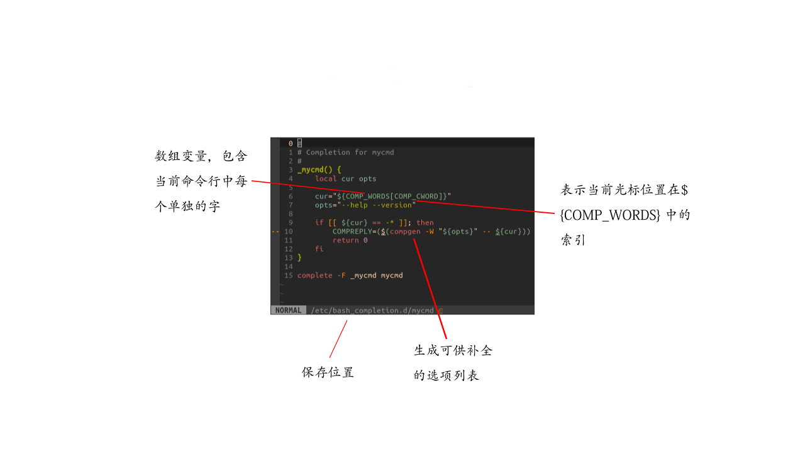
```

这是一个典型的 bash 脚本。开头的 `#` 为注释，用于说明补全的用途。

接着我们定义了一个名为 `_mycmd` 的函数，该函数包含用来处理 `mycmd` 命令的选项的逻辑。

`local` 声明了两个变量：`cur` 和 `opts`。其中，`cur` 存储当前在命令行正输入的字，它通过 bash 内置的变量 `COMP_WORDS` 和 `COMP_CWORD` 获取。

- `COMP_WORDS`：数组变量，包含当前命令行中单独的字。
- `COMP_CWORD`：表示当前光标位置在 `${COMP_WORDS}` 中的索引。

而 `opts` 则用来保存 `mycmd` 命令所有的命令选项。

然后，我们判断 `$cur` 是否为 `-` 打头，若为真，那么就用 `compgen` 命令来生成可供补全的选项列表。`-W` 选项后跟我们需要的 `mycmd` 命令选项。

与此同时，我们将 `compgen` 产生的输出赋给又一个 bash 内置变量 `COMPREPLY`。这样，当需要补全时，bash 就会采用 `compgen` 生成的补全列表了。

最后，我们用 `complete` 将补全函数 `_mycmd`（`-F` 选项）与程序 `mycmd` 绑定在一起即可。

### zsh 示例

现在，让我们来看看在 zsh 中又怎么实现可编程补全吧。

假如我们把 `mycmd` 的补全代码保存到 `$HOME/.zsh/_mycmd` 中的话，那么需要在 `$HOME/.zshrc` 里设置 `$fpath`，以便 zsh 能够加载我们的补全代码。

```bash
fpath=($HOME/.zsh $fpath)
```

下面就是我们针对 zsh 而改写的 `mycmd` 自动补全代码。如图 \@ref(fig:completion-prog-zsh) 所示。

```bash
#compdef mycmd
#
# Completion for mycmd
#
_mycmd() {
    local cur opts

    cur="${words[CURRENT]}"
    opts=(--help --version)

    if [[ ${cur} == -* ]]; then
        compadd -- ${opts}
        return 0
    fi
}

_mycmd "$@"
```

```{r completion-prog-zsh, echo=FALSE, fig.cap='zsh 可编程补全示例'}
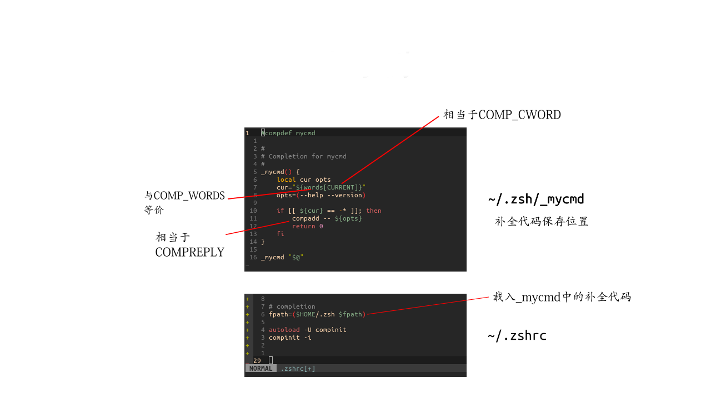
```

第一行的注释并非普通注释（`#compdef mycmd`），它允许 zsh 为我们自动载入补全代码。

接下来定义的函数与变量跟 bash 示例相似，其中已经替换成 zsh 里等价的内容。

- `words` 相当于 bash 中的 `COMP_WORDS`
- `CURRENT` 与 bash 中的 `COMP_CWORD` 类似
- `COMPREPLY` 则和 `compadd` 这个内置的 zsh 命令相同

要试验 `mycmd` 在 zsh 中的补全效果，只需先执行一下 `source ~/.zshrc`。从下面的例子中，你可以看到 `mycmd` 的命令补全跟 bash 中几乎一样，当然也带着 zsh 原本的补全功能。

```bash
xiaodong@codeland:~$ mycmd --
--help     --version
```

值得一提的是，zsh 本身还提供了一些辅助函数以用于补全，比如 `_arguments`、`_describe`、`_message` 等等，各位读者诸君不妨参考 zsh 的官方文档详加了解，以便用到自己的补全代码中。