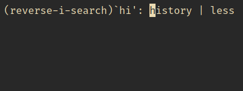
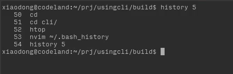
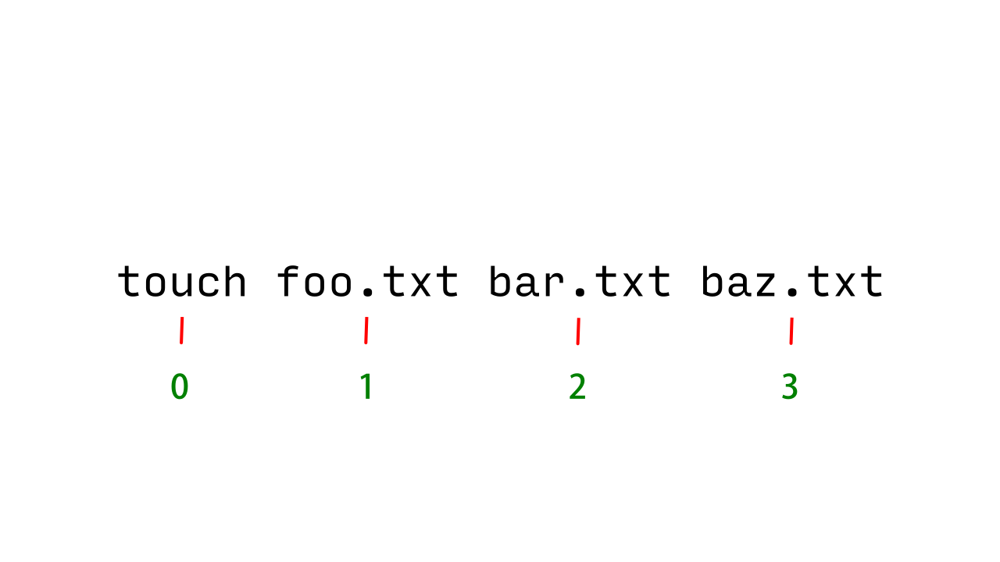
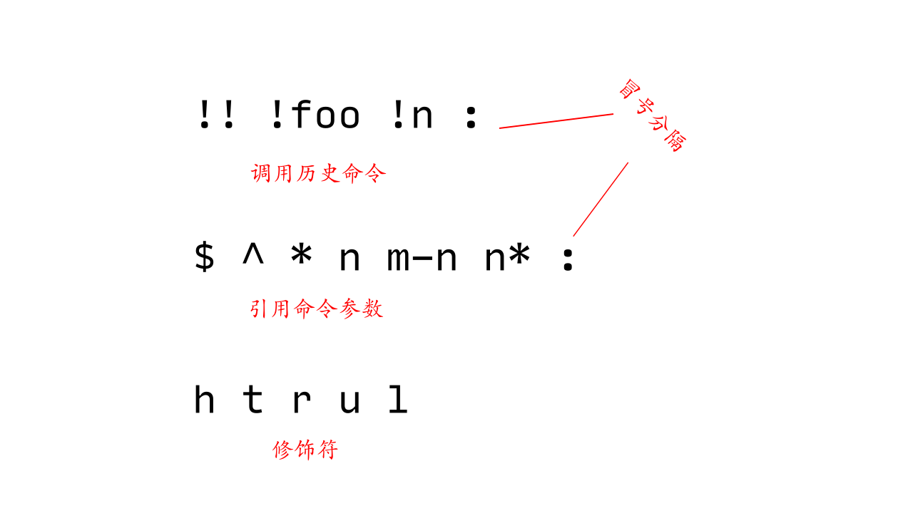

# 重温历史

在编程领域有一个十分重要的原则，那就是如何想办法来重复利用代码。比如，通过把具有相同逻辑的代码抽象成函数，从而能够加以反复调用。与之类似，在使用命令行时，我们也可以贯彻这个原则——重复利用已经执行过的命令。如果想要达到这样的效果，那么就该轮到 Shell 的历史功能出场了。

我们将先从设置历史变量谈起，接着讨论如何查看、搜索、以及前后移动历史命令，然后来看看怎样快速修改并执行历史命令，最后介绍快速引用历史命令的参数。

为了更好的重温历史，让我们首先来了解历史命令的保存位置和记录大小吧。

## 设置历史变量

无论是 bash 还是 zsh，都能够将我们已经执行过的命令存储到一个文件中。这样，便于我们以后对其加以重复使用。要查看 bash 或 zsh 的历史文件位置，不妨执行：

```bash
xiaodong@codeland:~$ echo $HISTFILE
```

在 bash 中，我们可以看到，这个文件默认是存储到 `~/.bash_history` 的。但是，因为 zsh 默认并没有设置该变量，所以内容为空。

通过向 `$HISTFILE` 变量赋予新值，从而能够更改历史文件的保存位置。下面，我们将 zsh 的历史文件设置为 `~/.zsh_history`。先使用文本编辑器（比如 `nvim`）打开 `~/.zshrc`，然后添加下行内容：

```bash
HISTFILE=~/.zsh_history
```

对 bash 而言，另外两个重要的历史变量是 `$HISTFILESIZE` 和 `$HISTSIZE`。其中，前者为 `$HISTFILE` 文件所能保存的最大行数，而后者则为 Shell 中记忆的最大历史命令数。这两个变量默认的设置都是 500，换句话说 `~/.bash_history` 文件最多保留 500 行，且最多 500 个命令。为了最大限度的利用历史文件的价值，我们不妨考虑把这两个变量的值设得更大一些，比如 5000：

```bash
HISTFILESIZE=5000
HISTSIZE=5000
```

将以上两行内容追加到 `~/.bashrc` 中以便永久保存设置。通常将这两个变量设置的值保持一致，否则在 `$HISTFILE` 中保存的内容可能会被截断。比如，在 `$HISTSIZE` 设为 1000 的情况下，而 `$HISTFILESIZE` 却为 500。因为历史命令数大于文件的行数，所以有部分历史命令不能保存到历史文件中。

`$HISTSIZE` 变量在 zsh 中同样有效，但与 `$HISTFILESIZE` 变量等价的却变成了 `$SAVEHIST`。类似的，我们将 `~/.zsh_history` 保留的最大行数和命令数也设为 5000：

```bash
SAVEHIST=5000
HISTSIZE=5000
```

把上面两行内容添加到 `~/.zshrc` 中以便永久保存设置。

既然存储的这些历史命令如此重要，那么就很有必要维护一个整洁、有价值的命令清单了。比如，剔除掉那些重复的命令、开头包含空格的命令、以及常用的简单命令等等。要实现这个目的，在 bash 中我们可以使用 `$HISTCONTROL` 变量。

`$HISTCONTROL` 采用冒号分隔的列表来决定是否将命令保存到历史文件中。例如，`erasedups` 表示去掉重复的命令，而 `ignorespace` 则意为除去开头具有空格的命令。

```bash
HISTCONTROL='erasedups:ignorespace'
```

在 zsh 中没有与 bash 对应的内置变量 `$HISTCONTROL`，不过可以通过设置选项来达到同样的效果：

```bash
setopt HIST_IGNORE_ALL_DUPS # 去掉重复的命令
setopt HIST_IGNORE_SPACE    # 去掉开头具有空格的命令
```

## 查看历史命令

Shell 本身提供了 `history` 这个内置命令来让我们随时查看所记录的历史命令。当我们执行 `history` 后，Shell 记录的所有历史命令便被回显出来。如果历史命令太多，不妨将其管道给页面查看程序 `less`，这样可以分屏查看：

```bash
xiaodong@codeland:~$ history | less
    1  echo $HISTSIZE
    2  sudo -i
    3  cat .bashrc
    4  cat .bash_profile
    5* cat .bash_history
```

每行命令前面的数字是该行命令的编号。数字后面带 `*` 号的行则说明已经被修改过。

`history` 比较有用的一个选项是，它后面可以跟一个数字（比如 5）。这样，在 bash 中就可以看到倒数的 5 个历史命令。

```bash
xiaodong@codeland:~$ history 5
```

值得注意的是，zsh 中需要在 5 前面加个 `-` 号：

```bash
xiaodong@codeland:~$ history -5
```

另外，在 zsh 中，我们也可以给 `history` 两个负数，以便查看中间的一段历史命令：

```bash
xiaodong@codeland:~$ history -10 -5
```

这表示从倒数第 10 个到倒数第 5 个之间的历史命令。

对 zsh 来说，它还能向我们提供更多的历史命令细节，包括命令执行的日期和时间，以及每个命令持续运行的时间：

```bash
xiaodong@codeland:~$ history -i -D
```

这里的 `-i` 选项向我们展示了命令执行的日期及时间，而 `-D` 选项则说明了命令运行了好久。

除了 `history` 之外，另一个用来查看历史命令列表的是 `fc`。我们利用 `fc` 的 `-l` 选项可以将历史命令列出来。例如：

```bash
xiaodong@codeland:~$ fc -l       # 列出最后 16 条命令
xiaodong@codeland:~$ fc -l -5    # 列出倒数 5 条命令
xiaodong@codeland:~$ fc -l 20 30 # 列出编号 20 到 30 的命令
xiaodong@codeland:~$ fc -l 100   # 列出编号为 100 后的所有命令
xiaodong@codeland:~$ fc -l cat   # 列出 cat 后的所有命令
```

通过 `fc` 的 `-e` 选项，我们还能够编辑历史命令列表。比如：

```bash
xiaodong@codeland:~$ fc -e vi 5 10
```

这将打开 `vi` 来编辑 5 到 10 条历史命令。

## 搜索历史命令

在搜索历史命令时，大家平时用得比较多的是将 `history` 与 `grep` 联用，从而过滤出需要的命令：

```bash
xiaodong@codeland:~$ history | grep 'xxx'
```

我个人比较喜欢使用的方式是按 **Ctrl + r** 组合键，这样 Shell 会让我们逆向搜索历史命令，比用 `grep` 更加方便。

当我在 bash 中按 **Ctrl + r** 后，Shell 给我提示 reverse-i-search（在 zsh 中这个提示略有不同，为 bck-i-search），然后我可以在冒号后面键入要搜索的字符串，比如 `hi`。此时，Shell 从历史命令中找到了 `history`，按**回车键**可以立即执行该命令。如果想要对命令加以修改，则只需按**→️ (右方向键)**。如图 \@ref(fig:history-search) 所示。

```{r history-search, echo=FALSE, fig.cap='逆向搜索历史命令'}

```

这是一个增量搜索引擎，我们每键入一个字符，Shell 便对历史命令列表进行匹配。若是匹配成功，则显出结果。要是匹配失败，我们还可以按**退格键**删除字符，然后重新输入来继续搜索。

## 前后移动历史命令

除 **Ctrl + r** 之外，我经常使用的另外两组快捷键是 **Ctrl + p** 和 **Ctrl + n**。这两组快捷键能够让我们在历史命令列表中前后移动。参考表 \@ref(tab:move-history)。

Table: (\#tab:move-history) 前后移动历史命令

| 按键     | 作用           |
| -------- | -------------- |
| Ctrl + p | 移到前一条命令 |
| Ctrl + n | 移到后一条命令 |

如果我们多次按这两组快捷键，则可以连续前移或后移。这些快捷键 bash 和 zsh 都支持。

## 快速修改并执行上一条命令

平常在使用命令行时，我经常会遇到的情况是，要么不小心，要么手太快，总之命令没有输入正确就执行了。这时候，我可不想再次重新输入命令，只想对上一条命令稍微作一下修改。那么，Shell 有没有什么快速而简便的操作方法呢？回答是肯定的，且听我慢慢道来。

### 删掉多余内容

例如，我在使用 `grep` 过滤日志时，不幸多输入了一个 `o`（原本是 lolcat）：

```bash
xiaodong@codeland:~$ grep loolcat /var/log/pacman.log
```

我们没有必要重新输入这条命令，只需执行 `^o` 即可将多余的 `o` 字符删除。

```bash
xiaodong@codeland:~$ ^o
xiaodong@codeland:~$ grep lolcat /var/log/pacman.log
```

Shell 在回显出正确的命令后立即执行了它。这里的 `^o` 将上一条命令中找到的第一个 `o` 字符删除，从而纠正了输错的命令。

### 替换内容

让我们来看另一个例子，我在查看 `file1` 这个文件的内容时错输成了 `flie1`：

```bash
xiaodong@codeland:~$ cat flie1
```

现在我们可以用 `^li^il` 来将输错的 `li` 替换为 `il`。同样，Shell 回显出正确的命令并予以执行。

```bash
xiaodong@codeland:~$ ^li^il
xiaodong@codeland:~$ cat file1
```

即便在没有输错的情况下，`^old^new` 也是很实用的。假如我在查看 `file1` 后接着想查看 `file4`，那么只要执行 `^1^4`：

```bash
xiaodong@codeland:~$ cat file1
xiaodong@codeland:~$ ^1^4
xiaodong@codeland:~$ cat file4
```

### 全局替换

还有一种情况，有时候我们想不只替换一处，而是把上一条命令中的每处内容都替换掉。要实现这种效果，可以使用 `!:gs/old/new`，其中，`!` 表示引用上一条命令（在后续的章节中我们将详细讲解），`:` (冒号) 后边的 `gs` 意为全局（`g`）替换（`s`），`/old/new` 则与 `^old^new` 相似。

```bash
xiaodong@codeland:~$ ansible nginx -a 'which nginx'
```

这条命令让我通过 Ansible 了解 nginx 分组的所有机器是否都包含 nginx 程序。接下来，我想看看 haproxy 分组的情况，于是我执行：

```bash
xiaodong@codeland:~$ !:gs/nginx/haproxy
xiaodong@codeland:~$ ansible haproxy -a 'which haproxy'
```

顺便提一句，在 zsh 中除了支持上述方式外，也可以使用：

```bash
xiaodong@codeland:~$ ansible nginx -a 'which nginx'
xiaodong@codeland:~$ ^nginx^haproxy^:G
xiaodong@codeland:~$ ansible haproxy -a 'which haproxy'
```

## 快速执行历史命令

既然我们把已经执行过的命令存储到 Shell 的历史文件中，那么自然想有一天能够再次用到它。正所谓“养兵千日，用兵一时”。下面，我们就来看一看如何快速的执行已有的历史命令。

### 重复执行上一条命令

一种常见的使用场景是，我在使用 `htop` 查看系统状态并退出后，过一会儿想再次查看它。此时，我们无需重新输入 `htop` 命令，只需按两下 `!!` 并敲**回车**即可。

```bash
xiaodong@codeland:~$ htop
xiaodong@codeland:~$ !!
```

`!!` 被称为 bang bang，是我最喜欢使用，同时也是使用频率极高的历史命令调用表示。`!!` 让我们以最快的方式重复执行上一条命令。

`!!` 经常与 `sudo` 联用，用来解决缺少权限的问题。例如：

```bash
xiaodong@codeland:~$ pacman -S figlet
error: you cannot perform this operation unless you are root.
```

在此，我用 `pacman` 来安装 figlet，但由于是普通账户，所以没有权限操作。要解决这个问题，我们只要输入：

```bash
xiaodong@codeland:~$ sudo !!
xiaodong@codeland:~$ sudo pacman -S figlet
```

### 执行以某些字符打头的命令

利用 `!foo` 这种表示法允许我们执行以 `foo` 这三个字符打头的命令。Shell 将以逆序的方式搜索历史命令列表，一旦与给定的开头字符匹配到，便予以执行该条命令。例如：

```bash
xiaodong@codeland:~$ !he
xiaodong@codeland:~$ help
```

该表示从历史命令列表中找到 `help` 后执行。

```{block2, type='rmdtip'}
如果不能确定所找到命令的完整内容，那么可以在其后追加 `:p`。这样，Shell 将打印出该命令，并不会执行。

    xiaodong@codeland:~$ !he:p

这里的 `:p` 为修饰符，在后面的内容中我们会详细讲解。
```

### 执行历史列表中第 n 个命令

在 `!` 后面除了可以跟一个字符串之外，也可以跟一个数字。这个数字代表历史命令列表中的编号。当我们用 `history` 查看历史命令列表时，命令左边显示的即是该行命令的编号。例如：

```bash
xiaodong@codeland:~$ history 5
```

这里显示 `htop` 的编号为 52，如图 \@ref(fig:history-five) 所示。

```{r history-five, echo=FALSE, fig.cap='history 5 执行结果'}

```

所以我们可以用：

```bash
xiaodong@codeland:~$ !52
```

来再次执行 `htop`。

```{block2, type='rmdtip'}
请想想看，如果在 `!` 后面加一个负数（如 -2）会怎样呢？

    xiaodong@codeland:~$ !-2

这同样是一种有效的表示，不过它是以倒序的方式去执行命令。`-2` 意味着倒数第 2 条历史命令。
```

利用 `!-2`，我经常使用的一个场景是，先用文本编辑器编辑源代码，接着再编译源代码。如果我需要再次编辑和编译，那么只要反复执行 `!-2` 即可。如此不断循环。

```bash
xiaodong@codeland:~$ nvim first.c
xiaodong@codeland:~$ gcc -o first first.c
xiaodong@codeland:~$ !-2 # 再编辑
xiaodong@codeland:~$ !-2 # 再编译
```

顺便说一句，因为 `!-1` 是如此常见，所以 Shell 提供了简写形式 `!!`。

## 快速引用上一条命令的参数

很多时候，我们即将执行的命令与之前的命令具有相同的参数，比如同样的文件名、路径名等等。所以，我们在执行新的命令时无需重新输入这些同样的参数，只要直接从其引用过来即可。

### 引用最后一位参数

我最常用的是 `!$`，它允许我直接复用上一条命令的最后一位参数。当我用 `mkdir` 创建目录后，使用它来立即转到该目录：

```bash
xiaodong@codeland:~$ mkdir videos
xiaodong@codeland:~$ cd !$
```

这里，`cd` 命令后的 `!$` 等同于上一条命令中的 `videos`。

```{block2, type='rmdtip'}
除了利用 `!$`，你也可以按 **Alt + .** 这组快捷键来达到同样的目的。
```

### 引用最开头的参数

与最后一位参数相反，`!^` 能够让我们引用上一条命令中最开头的参数。这里的 `^` 和 `$` 与正则表达式中的锚点类似。请看例子：

```bash
xiaodong@codeland:~$ ls /usr/share/doc /usr/share/man
xiaodong@codeland:~$ cd !^
```

在该例中，`!^` 相当于上一条命令中的路径 `/usr/share/doc`。

```{block2, type='rmdtip'}
组合键 **Ctrl + Alt + y** 可以实现同样的效果。
```

### 引用所有参数

不光是开头或结尾的参数，有时候我们想要引用的是上一条命令的所有参数。此时，我们可以使用 `!*`，这里的 `*` 意为全部。比如：

```bash
xiaodong@codeland:~$ ls src code
xiaodong@codeland:~$ cp -r !*
```

`cp` 命令中的 `!*` 跟 `src code` 同样，它表示两个参数都要引用。

### 引用第 n 个参数

对于引用上一条命令中的参数，我们甚至可以要求 Shell 精确到具体的第几个。因为 Shell 按照空白来解析命令行，所以它给命令本身编号为 0，后续的选项和参数按 1、2、3 等依次编号。如图 \@ref(fig:history-word) 所示。这就好比程序中的数组一样。在下面的例子中，假如我们想要引用 `bar.txt`，除开 `touch`，按顺序它应该是第 2 个参数，因此可以像这样表示：

```{r history-word, echo=FALSE, fig.cap='命令及选项参数编号'}

```

```bash
xiaodong@codeland:~$ touch foo.txt bar.txt baz.txt
xiaodong@codeland:~$ nvim !:2
```

`nvim` 命令中的 `!:2` 就相当于上一条命令中的 `bar.txt` 文本文件。

```{block2, type='rmdnote'}
这里的 `:`（冒号）很重要，若没有的话，就等于执行历史命令列表中的编号为 2 的命令了。
```

### 引用从 m 到 n 的参数

还有一种情况可能会遇到，即同时引用上一条命令的好几个参数。此时，我们可以使用 `!:m-n` 表示法，`m` 为开始端，`n` 为结束端。我们继续以上例来说明：

```bash
xiaodong@codeland:~$ touch foo.txt bar.txt baz.txt
xiaodong@codeland:~$ nvim !:1-2
```

这里的 `!:1-2` 让我们引用 `touch` 命令中的前两个参数。

### 引用从 n 到最后的参数

我们最后再介绍一种情况，通过 `!:n*` 这种表示让我们能够从上一条命令中引用从第 n 个到最后的参数。例如：

```bash
xiaodong@codeland:~$ cat /etc/resolv.conf /etc/hosts /etc/hostname
xiaodong@codeland:~$ nvim !:2*
```

此处的 `!:2*` 允许我将 `hosts` 和 `hostname` 同时打开进行编辑。

值得提及的是，我们在此主要介绍的是如何引用上一条命令的参数，因为这是最为常见的使用场景。结合我们前面所讲的快速执行历史命令，我们也可以引用历史列表中其它命令的参数。比如：

```bash
xiaodong@codeland:~$ !hi:2
```

这将引用以 `hi` 打头的命令的第 2 个参数。

```bash
xiaodong@codeland:~$ !10:2-3
```

而这将引用第 10 条命令的 2、3 两个参数。

## 快速引用参数的部分内容

在上一节我们介绍了如何引用历史命令中的参数，除此之外，Shell 甚至比我们想要得到的做得更多。利用 Shell 提供的历史展开模式修饰符，使我们得以快速引用参数中的部分内容。

### 引用路径开头

请看例子：

```bash
xiaodong@codeland:~$ ls /usr/share/fonts/truetype
xiaodong@codeland:~$ cd !$:h
```

在此，我想引用该路径的开头部分 `/usr/share/fonts`。为了达到这个目的，我在 `!$`（最后一位参数）的基础上添加了 `:h`。此处的 `:h` 为修饰符，意味着截取路径的开头部分，正如 `dirname` 的效果一样。

```{block2, type='rmdtip'}
助记技巧，将 `:h` 想成 `head` 的开头字符。
```

### 引用路径结尾

有头就有尾。通过 `:t` 修饰符，我们可以引用路径的结尾部分，其效果跟 `basename` 类似。

```bash
xiaodong@codeland:~$ wget http://nginx.org/download/nginx-1.15.8.tar.gz
xiaodong@codeland:~$ tar zxvf !$:t
```

经过 `!$:t` 引用后，我们的命令变成了：

```bash
xiaodong@codeland:~$ tar zxvf nginx-1.15.8.tar.gz
```

```{block2, type='rmdtip'}
助记技巧，将 `:t` 想成 `tail` 的开头字符。
```

### 引用文件名

对于存在文件名的情形，我们还可以利用 `:r` 修饰符来只引用文件名部分（这将排除掉扩展名）。例如：

```bash
xiaodong@codeland:~$ unzip hello.zip
xiaodong@codeland:~$ cd !$:r
```

这里的 `!$:r` 将 `hello.zip` 去掉扩展名，只保留 `hello` 部分。

### 将引用部分更改为大写

下面介绍的两个修饰符为 zsh 所特有，bash 目前尚不支持。通过 `:u` 修饰符，我们能够将所引用的部分更改为大写字母。

```bash
xiaodong@codeland:~$ echo histchars
xiaodong@codeland:~$ echo !$:u
```

这里的 `!$:u` 将 `histchars` 全部更改为大写字母。

```{block2, type='rmdtip'}
助记技巧，将 `:u` 想成 `uppercase` 的开头字符。
```

### 将引用部分更改为小写

与 `:u` 相对的是，`:l` 则使我们能够将所引用的参数全部更改为小写字母。

```bash
xiaodong@codeland:~$ echo SAVEHIST
xiaodong@codeland:~$ echo !$:l
```

这里的 `!$:l` 将 `SAVEHIST` 全部更改为小写字母。

```{block2, type='rmdtip'}
助记技巧，将 `:l` 想成 `lowercase` 的开头字符。
```

需要特别指出的是，Shell 还支持将多个修饰符进行联用，在它们之间只需使用 `:` (冒号) 分隔即可。例如：

```bash
xiaodong@codeland:~$ ls /usr/share/fonts/truetype
xiaodong@codeland:~$ echo !$:t:u
xiaodong@codeland:~$ echo TRUETYPE
```

这里，我们先用 `:t` 引用了路径的结尾部分，然后又使用 `:u` 将其更改为了大写字母。

## 历史命令展开模式总结

最后，我们来总结一下历史命令展开的模式。从前面我们所讲的内容来看，历史展开模式包括以下三个部分：

1. `!! !foo !n`：用来调用历史列表中的命令
2. `$ ^ * n m-n n*`：引用命令参数的各个部分
3. `h t r u l`：修饰符，对所引用的内容进行修改

如图 \@ref(fig:history-mode-i) 所示。

```{r history-mode-i, echo=FALSE, fig.cap='历史命令展开模式'}

```

模式的每个部分之间都用 `:`（冒号）进行分隔。让我们来看一个包含三个部分的例子：

```bash
xiaodong@codeland:~$ !ec:$:t
```

这个模式的含义是，引用 `ec` 打头命令的最后一位参数，并只保留路径尾部。