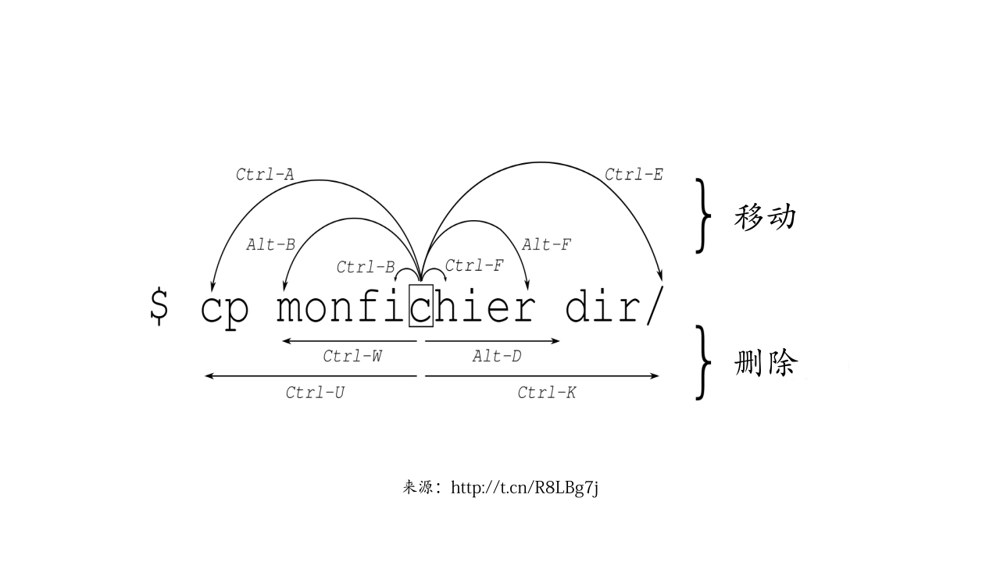
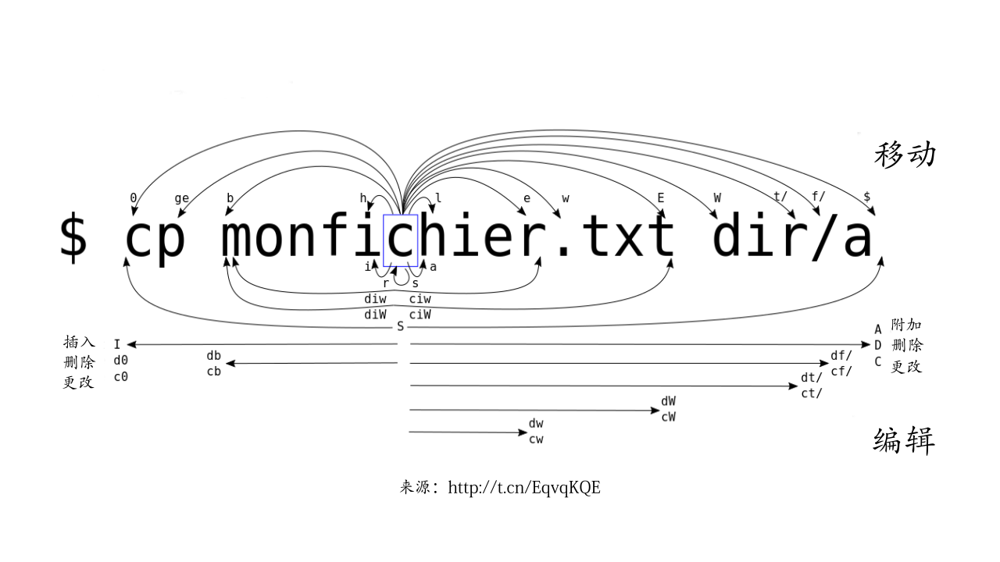

# 编辑大法

当我们在 Vim、Emacs、Sublime、VS Code 等熟悉的编辑器中编辑文本时，通常会有一种十分舒服的感觉。这是因为我们已经习惯了这些编辑器的操作方法。要是 Shell 命令行也能像文本编辑器一样编辑命令，那样的话我们的命令行编辑效率一定会大大提升。相信我，产生这种想法的人绝不止你我。无论是 bash，还是 zsh 的开发者，他们都同样想到了这个问题。正因为如此，所以我们今天才能沿用 Emacs 和 vi 这两个经典的文本编辑器的编辑习惯来编辑命令行。

在本章内容中，我们将先介绍在 Shell 中如何选择 Emacs 或 vi 编辑模式。接着进入 Emacs 编辑模式实战，包括按字、“词”、行来移动和删除的操作方法。最后，我们再讲解怎样在 vi 编辑模式中移动操作、重复执行命令、添加文本、删除文本、替换文本、以及搜索字符等内容。在学完这些内容后，对于编辑命令行而言，你将变得更加游刃有余。

## 设置编辑模式

既然 bash 与 zsh 都提供了 Emacs 和 vi 两种编辑模式，那么如何在这两种编辑模式之间进行选择呢？一般而言，在 Emacs 模式下，编辑操作显得更加自然，上手起来相对也更快一些。如果你从来没有使用过 vi 编辑器，那么选用 vi 编辑模式，一开始将会有找不到北的感觉。在 vi 模式下，按键要么能插入文本，要么能执行编辑指令，你需要在两种状态间不断来回切换。Emacs 模式跟 vi 模式相比更加简单，在使用上也会更容易一些。因此，推荐大家优先选择使用 Emacs 编辑模式。这也是 bash 和 zsh 都将 Emacs 作为默认的命令行编辑模式的原因。但是，假如你对 vi 的操作方法非常感兴趣的话，那么不妨选择使用 vi 编辑模式，去做那个敢于吃螃蟹的人。

bash 和 zsh 两个都支持使用 `set` 指令来设置命令行编辑模式。例如，假如我们想要设为 vi 编辑模式，只需执行：

```bash
xiaodong@codeland:~$ set -o vi
```

要重新设为 Emacs 编辑模式，则执行：

```bash
xiaodong@codeland:~$ set -o emacs
```

在 zsh 中，我们也可以通过 `bindkey` 来设置 Emacs 或 vi 编辑模式。

```bash
xiaodong@codeland:~$ bindkey -e
```

该命令将 Emacs 作为编辑模式。如果打算设置为 vi 编辑模式，那么使用 `-v` 选项即可：

```bash
xiaodong@codeland:~$ bindkey -v
```

为了永久保存设置，我们需要将 bash 的设置选项添加到 `~/.bashrc` 配置文件。

而 zsh 的设置选项则需添加到 `~/.zshrc` 配置文件。

## Emacs 编辑模式实战

### 按字移动和删除

让我们先在命令行输入一些字符，然后来看看如何一个一个的移动字符：

```bash
xiaodong@codeland:~$ echo 像骇客一样
```

糟糕，我将“黑客”错输成了“骇客”，现在我要将光标向左移到“客”字，接着删除“骇”字，然后再重新输入正确的“黑”字。

对于命令行新手来说，可能会使用**左方向键（←）**向左移动字符。好，我们来试一下。按 3 下**左方向键（←）**，于是光标停留在“客”字上。此时，我们再按**退格键**则删除光标左边的“骇”字。我们接着重新输入正确的“黑”字。因为我们还要继续输入新的内容，所以按 3 下**右方向键（→）**往右移动光标，直到行尾。之后，我们能够再输入新的内容“使用命令行”。

在上面的操作中，我们通过分别按**左方向键（←）**和**右方向键（→）**来向左或往右移动一个字符。利用 Emacs 编辑模式，其实有比按**左右方向键**更好的操作方法。因为**左右方向键**通常远离键盘中心区域，所以与 Emacs 编辑模式提供的操作方法比起来在效率上会有所降低。

下面，我们就用 Emacs 编辑模式所提供的操作方法来一个个的移动字符。在 Emacs 编辑模式中，向左移动一个字符可以按 **Ctrl + b**。因此，我们按 3 次 **Ctrl + b**，此时光标位于“客”字上。同样的，我们通过按**退格键**来删除“骇”字。在输入“黑”字后，我们需要将光标移到最右边。现在，我们可以按 **Ctrl + f**，以便往右移动一个字符。需要往右移动几个字符就按几下 **Ctrl + f**。顺便说一句，在后面的内容中，我们会讲到如何一下子就移到最右边的操作方法。此刻，就先让我们熟悉按字移动的操作吧。

上述操作中我们使用**退格键**删除光标左边的字符。假如我们向左多移动了一个字符，那么此时光标将在“骇”字上。要想删除“骇”字，难道再往右移动吗？当然不必。Emacs 编辑模式为我们提供了 **Ctrl + d** 来删除光标下的字符。

```{block2, type='rmdnote'}
在空的命令行按 **Ctrl + d** 将退出 Shell。
```

在此，我们再介绍一组快捷键：**Ctrl + t**。这组按键的作用是将光标左边的两个字符交换顺序。例如，当我在输入

```bash
xiaodong@codeland:~$ sl
```

后，通过按下 **Ctrl + t** 便能够将其变成 `ls`。

```bash
xiaodong@codeland:~$ ls
```

总结起来，按字移动和删除的操作方法参考表 \@ref(tab:emacs-char)。

Table: (\#tab:emacs-char) Emacs 模式按字移动和删除的操作方法

| 按键     | 作用                         |
| -------- | ---------------------------- |
| Ctrl + b | 向左移动一个字符             |
| Ctrl + f | 往右移动一个字符             |
| 退格键   | 删除光标左边的字符           |
| Ctrl + d | 删除光标下的字符             |
| Ctrl + t | 将光标左边的两个字符交换顺序 |

### 按“词”移动和删除

按字符移动和删除毕竟有些琐碎，为了完成某个操作，有时候需要我们按下很多次快捷键。有鉴于此，Emacs 编辑模式针对“词”这个更大的范围提供了移动和删除的操作方法。值得注意的是，我们在此给“词”添加了引号。换句话说，这里的“词”是 Shell 所理解的“词”的含义，与现实生活中所谓的词含义并不相同。在 bash 中，“词”即字母和数字的组合，例如 file1 这种，其中并不包含特殊字符在内。而在 zsh 中，对“词”的界定跟 bash 又有所不同，除了字母和数字之外，还包括比如 `*`、`?`、`_`、`-` 等这样的符号。通过变量 `WORDCHARS`，我们可以看到这类字符到底有哪些。在我的系统中，执行

```bash
xiaodong@codeland:~$ echo $WORDCHARS

```

后，可以见到有如下字符：

```bash
*?_-.[]~=/&;!#$%^(){}<>
```

如果你想要让 zsh 判定“词”的行为跟 bash 一样的话，那么不妨将 `WORDCHARS` 变量的值设为空：

```bash
xiaodong@codeland:~$ WORDCHARS=
```

下面我们来看一个按“词”移动和删除的操作例子：

```bash
xiaodong@codeland:~$ grep 'figlet' /var/log/pacman.log
```

在我输入该命令行后，忽然想到应该查询 `lolcat` 这个包。为了将 `figlet` 改成 `lolcat`，我按 **Alt + b** 向左一个“词”一个“词”的移动。按 5 下后，此时光标停留在 `figlet` 的 `f` 上。接着，我按 **Alt + d** 删除光标右边的“词”（也就是 `figlet`）。然后输入新的内容 `lolcat`。

现在，如果不需要再输入内容的话，则可以直接按**回车键**执行命令。但因为我还想将标准输出的内容保存起来，所以继续按 **Alt + f** 来往右按“词”移动。当抵达最右边时，再输入新的内容 `> /tmp/output.log`。此刻，我们的命令行是：

```bash
xiaodong@codeland:~$ grep 'logcat' /var/log/pacman.log \
> /tmp/output.log
```

最后，我按 **Alt + 退格键**（或 **Ctrl + w**）删除光标左边的 `log`，并输入 `txt` 来完成该命令行的编辑。

正如前面所述，在 zsh 中按“词”移动的行为跟 bash 略有不同。这是因为它们对“词”界定的含义不一样的缘故。我们仍旧以上面的例子来加以说明。在光标都位于该命令行最右边的情况下，bash 中按 **Alt + b** 向左移动到的是 `txt` 中开头的 `t` 上；而在 zsh 中同样的操作却移动到了 `/tmp/output.txt` 开头的 `/`。在此，我们可以发现 zsh 将 `/` 和 `.` 都看作“词”的一部分。两个 Shell 比较起来，zsh 移动更快，按键也更少，但是粒度却要粗一些。因为 zsh 对“词”的界定范围比 bash 更宽，所以对“词”的删除内容也更多。bash 中按 **Alt + d** 删除的是 `txt`，而 zsh 中删除的却是 `/tmp/output.txt`。

需要特别指出的是，通过 **Alt + 退格键** 和 **Alt + d** 删除的内容，Shell 并没有丢弃，而是将其保存在 kill ring 中。你可以将 kill ring 看作一个特殊的剪贴板。当然，它里面的内容我们也是可以获取的。我们只需按 **Ctrl + y** 即可获取上次删除的内容。

此外，与 **Ctrl + t** 交换光标左边的两个字符相似，**Alt + t** 能够用来交换光标左边两个“词”的顺序。例如：

```bash
xiaodong@codeland:~$ echo bar foo
```

当我们按 **Alt + t** 后，该命令行将变成：

```bash
xiaodong@codeland:~$ echo foo bar
```

以下介绍的几组快捷键用于更改“词”的大小写。例如，我们在命令行输入

```bash
xiaodong@codeland:~$ echo foo
```

并按 **Alt + b** 将光标移到 `f` 上后，此时，按 **Esc + c** 把 `foo` 变成 `Foo`；若是按 **Esc + u**，则将变为 `FOO`；最后，按 **Esc + l**，又将成为 `foo`。

按“词”移动和删除的操作方法参考表 \@ref(tab:emacs-word)。

Table: (\#tab:emacs-word) Emacs 模式按“词”移动和删除的操作方法

| 按键         | 作用                                 |
| ------------ | ------------------------------------ |
| Alt + b      | 向左移动一个“词”                   |
| Alt + f      | 往右移动一个“词”                   |
| Alt + 退格键 | 删除光标左边的“词”                 |
| Ctrl + w     | 同上                                 |
| Alt + d      | 删除光标右边的“词”                 |
| Ctrl + y     | 获取上次删除的内容                   |
| Alt + t      | 交换光标左边两个“词”的顺序         |
| Esc + c      | 将光标右边的“词”的开头字母变成大写 |
| Esc + u      | 将光标右边的“词”全部更改为大写字母 |
| Esc + l      | 将光标右边的“词”全部更改为小写字母 |

### 按行移动和删除

比“词”范围更大的移动及删除操作是行。相对“词”而言，我们只需要更少的按键即可移到更广的区域。由此，也将删除更多的命令行内容。让我们通过一个例子来说明：

```bash
xiaodong@codeland:~$ grep 'set' *.txt
```

在此，我想找出当前目录中包含 `set` 的所有文件。假如我想将这行命令改成：

```bash
xiaodong@codeland:~$ egrep 'set' *.md
```

首先，我按 **Ctrl + a** 将光标移到该命令行的行首（也就是最左边）。接着输入 `e` 将命令改成 `egrep`。然后，我再按 **Ctrl + e** 将光标移到此行的结尾处（也就是最右边）。在通过 **Alt + 退格键** 删除 `txt` 后，重新输入 `md` 即可完成对该命令行的修改。

下面，我们来看看针对行的删除操作。依然请出我们的老朋友 `foo`、`bar`、`baz`：

```bash
xiaodong@codeland:~$ echo foo bar baz
```

我们先按两下 **Alt + b** 将光标移到 `bar` 的 `b` 上。现在，如果我们打算删除 `bar` 和 `baz`，那么只要按 **Ctrl + k**；反之，但假设我们想要删除 `echo` 及 `foo` 的话，则需按 **Ctrl + u**。值得说明的是，在 zsh 中，**Ctrl + u** 的行为与 bash 中并不相同，它是删除整行的全部内容。

按行移动和删除的操作方法参考表 \@ref(tab:emacs-line)。

Table: (\#tab:emacs-line) Emacs 模式按行移动和删除的操作方法

| 按键     | 作用                     |
| -------- | ------------------------ |
| Ctrl + a | 将光标移到行首（最左边） |
| Ctrl + e | 将光标移到行尾（最右边） |
| Ctrl + k | 从光标处往右删除至行尾   |
| Ctrl + u | 从光标处向左删除至行首   |

### Emacs 编辑模式总结

从前面我们所讲的内容来看，Emacs 编辑模式的内容编辑范围主要包括下列 3 种：

1. 字
2. “词”
3. 行

针对每一种范围，又包含两种编辑操作，分别为移动和删除。如图 \@ref(fig:emacs-mode) 所示。

```{r emacs-mode, fig.cap='Emacs 编辑模式图解'}

```

## vi 编辑模式实战

与 Emacs 编辑模式相比，vi 编辑模式为我们提供了更多的控制命令。相应地，在 vi 编辑模式下，我们能够操作的粒度也将更细。如果你以前从未使用过 vi 编辑模式的话，那么不妨在亲自体验一番之后再来作决定是否要继续用它。跟 vi 文本编辑器一样，Shell 的 vi 编辑模式也包含两种模式：插入模式和命令模式。在插入模式下，我们输入的字符为字符本身，并没有什么特殊含义，如：h 就是 h；而在命令模式中，我们所输入的字符则为用来执行编辑过程的命令，如：**h** 用来向左移动一个字符。默认情况下，我们进入的是插入模式。若是要进入命令模式，则需要我们按 **Esc 键**。在使用 vi 编辑模式时，我们有时候可能会感到迷糊，此刻到底处于哪种模式呢？遇到这种情况，不妨先按 **Esc 键** 回到命令模式再作进一步的操作。或许这算是选择 vi 编辑模式的小小代价吧。

### 移动命令

在 vi 编辑模式中，我们可以使用的光标移动命令参考表 \@ref(tab:vi-move)。

Table: (\#tab:vi-move) vi 模式移动命令

| 命令    | 作用                                            |
| ------- | ----------------------------------------------- |
| h       | 向左移动一个字符                                |
| l       | 往右移动一个字符                                |
| b       | 向左移动一个单词                                |
| w       | 往右移动一个单词                                |
| e       | 移到单词结尾                                    |
| B、W、E | 与 `b`、`w`、`e` 类似，按不同的单词定义进行移动 |
| 0       | 移到行首                                        |
| ^       | 移到行首，但第一个字符为非空白字符              |
| $       | 移到行尾                                        |

让我们输入一行命令来试试这些 vi 编辑模式中的移动命令：

```bash
xiaodong@codeland:~$ echo hello, this is a command
```

首先，按 **Esc 键**进入命令模式，此时光标位于 `command` 结尾的 `d` 上。

其次，通过 **h** 和 **l** 按一个个字符左右移动很直白，无需我们多言。值得讨论的是 **b**、**w**、**e** 跟它们对应的大写形式的区别：简而言之，**b**、**w**、**e** 将停留在空白或标点符号处（如该命令行中的 `,`（逗号）），而 **B**、**W**、**E** 则仅仅停留在空白处。例如，我们按 **b** 会经过 `,`，而按 **B** 将跳过 `,`。假如你想要移动更快的话，那么可以用大写字母的命令。而小写字母命令则对于更细粒度的移动有用，比如路径名这种情形。

最后，**0** 和 **^** 都是移到命令行的开头，不过其差异是 **0** 的开头可以为空白，而 **^** 的开头则不允许。例如：

```bash
xiaodong@codeland:~$  cd /var/log/nginx
```

按 **0** 移到开头的空格，按 **^** 移到 `cd` 的 `c` 上，按 **$** 移到行尾的 `x`。

### 重复命令

在 vi 命令模式下，每个移动命令之前可以跟一个数字，用来将该命令重复执行多次。例如，**3b** 表示向左移动 3 个单词，**5l** 则表示往右移动 5 个字符。值得注意的是，因为 **0** 本身也是一个命令，所以将它放在命令前面是无效的重复计数。

### 添加文本

我们已经知道通过按 **Esc 键**可以进入 vi 命令模式，但是，在命令模式下又如何回到插入模式呢？你只需参考表 \@ref(tab:vi-add) 中的命令来执行即可。

Table: (\#tab:vi-add) vi 模式添加文本的命令

| 命令 | 作用                       |
| ---- | -------------------------- |
| i    | 在光标左边插入新的文本内容 |
| a    | 在光标右边追加新的文本内容 |
| I    | 在行开头插入新的文本内容   |
| A    | 在行结尾追加新的文本内容   |

请看例子：

```bash
xiaodong@codeland:~$ hello vi
```

假如我打算将该命令改为

```bash
xiaodong@codeland:~$ echo hello, vi editing mode
```

那么可按以下方式执行编辑操作：

按 **2h** 将光标移到空格处，接着按 **i** 进入插入模式，然后输入新的 `,`。按 **Esc 键**回到命令模式后，继续按 **I** 以便在命令行开头插入 `echo`。再次按 **Esc 键**进入命令模式，最后按 **A** 在命令行的尾部追加 `editing mode`。

### 删除文本

利用 vi 模式提供的删除命令，我们不仅可以删除字符，而且也能删除单词，甚至整个命令行。这些删除命令参考表 \@ref(tab:vi-del)。

Table: (\#tab:vi-del) vi 模式删除文本的命令

| 命令 | 作用                                               |
| ---- | -------------------------------------------------- |
| x    | 删除光标下的字符                                   |
| X    | 删除光标左边的字符                                 |
| dm   | **m** 为某个移动指令，如 **db** 删除光标左边的单词 |
| D    | 从光标处删除到行尾                                 |
| dd   | 删除整行内容                                       |

跟移动命令一样，在上述删除命令之前也可以带一个数字，以便多次执行该命令。例如，**5x** 将删除 5 个字符，而 **3dw** 将删除 3 个单词，这里 3 的顺序并不重要，**d3w** 仍然同样有效。

通过删除命令删除的内容，Shell 并没有丢弃，而是将其保留在了删除缓冲器中。稍后，我们可以执行 **u** 命令来恢复这些删除的内容。如果想要恢复更早时间删除的内容，则只需按 **u 键**多次即可。

另外一种更有用的方式是复制和粘贴。这样，我们能够在保留原有内容的同时，再储存一份拷贝，以便后续使用。vi 模式中复制及粘贴的命令参考表 \@ref(tab:vi-copy)。

Table: (\#tab:vi-copy) vi 模式复制及粘贴命令

| 命令 | 作用                                                  |
| ---- | ----------------------------------------------------- |
| ym   | **m** 为某个移动命令，如**yw** 用来复制光标右边的单词 |
| p    | 在光标右边粘贴文本                                    |
| P    | **p** 的大写形式，在光标左边粘贴文本                  |

在下面的例子中，我们将看到上述命令的用法：

```bash
xiaodong@codeland:~$ echo command-line interface
```

先按 **Esc 键**进入命令模式，此时光标位于结尾的 e 上。按 **x** 将删除 e，按 **X** 将删除 a，按 **db** 将删除 interface 剩下的部分（只剩下字符 c），按 **dd** 则把整行内容都删掉。按 **u** 又还原刚删除的内容。

### 替换文本

当我们需要替换命令行中的内容时，除了在删除该内容后再进入插入模式重新输入外，也可以使用 vi 编辑模式所提供的文本替换命令。这些命令组合了删除与插入操作，用起来将更加直接。vi 编辑模式提供的文本替换命令参考表 \@ref(tab:vi-replace)。

Table: (\#tab:vi-replace) vi 模式替换文本的命令

| 命令 | 作用                               |
| ---- | ---------------------------------- |
| cm   | **m** 为某个移动命令，如 `cw`      |
| C    | 从光标处删除到行尾，并进入插入模式 |
| cc   | 删除整行，并进入插入模式           |
| r    | 替换光标下的字符                   |
| R    | 进入替换文本模式                   |
| s    | 利用输入的字符来替换光标下的字符   |

要想搞明白这些替换命令如何工作，不妨来试试以下编辑练习：

```bash
xiaodong@codeland:~$ echo talk is cheap. show me the kode.
```

同样的，我们按 **Esc 键**先进入命令模式，按 **cb** 将 kode 删除后进入了插入模式，我们输入新的内容 code。再次按 **Esc**，接着按 **4b** 左移到 show，按 **r** 将 s 替换成 S。

### 搜索字符

vi 编辑模式还提供了一组命令用于搜索命令行中的字符。利用这些命令，我们可以移动光标到特定的字符上。此外，将其跟 **d** 和 **c** 命令组合使用，还能够删除或更改从光标处到该字符的这一段文本。这些用于搜索字符的命令参考表 \@ref(tab:vi-search)。

Table: (\#tab:vi-search) vi 模式搜索字符的命令

| 命令 | 作用                                             |
| ---- | ------------------------------------------------ |
| fc   | 移动光标到 **c** 的下一处                        |
| Fc   | 与 **f** 相反方向搜索，移动光标到 **c** 的上一处 |
| tc   | 移动光标到 **c** 左边的字符                      |
| Tc   | 移动光标到 **c** 右边的字符                      |
| ;    | 重复上次的 **f** 或 **F** 命令                   |
| ,    | 以相反的方向重复上次的 **f** 或 **F** 命令       |

在下面的练习中，我们可以尝试上述字符搜索命令的用法：

```bash
xiaodong@codeland:~$ echo A program which handles the interface
```

在按 **Esc 键**进入命令模式后，按 **fp** 光标移到了 p 上，按 **th** 移到了 h 左边的 w。按 **Fm** 光标左移到 m 上。我们还可以试试其它的命令，以便熟悉这些命令的用途。

### vi 编辑模式总结

从前面我们所讲的内容来看，vi 编辑模式比 Emacs 编辑模式提供了更多的编辑命令。乍一看，似乎很复杂。我们除了勤加练习以期熟悉这些编辑命令之外，还可以总结出以下规律，从而帮助我们更好的加深理解。如图 \@ref(fig:vi-mode-i) 所示。

+ 跟 Emacs 编辑模式一样，我们同样可以按照字、“词”、行这 3 个维度来梳理操作命令
+ 删除命令 **d** 和更改命令 **c** 能够与移动命令组合使用
+ 移动命令、删除命令、更改命令之前可以加数字用来多次执行

```{r vi-mode-i, fig.cap='vi 编辑模式图解'}

```
