# 周边好品

在前面的章节中，我们主要讨论的是 Shell 本身自带的特性。因为 bash 和 zsh 都是开源软件，所以有许多热心的用户为其添砖加瓦，以便增强它们的功能，使其变得更加好用。本章我们将眼光从 Shell 自身移到周边，来看看由社区贡献的一些好工具。

## 配置框架

无论是 bash，还是 zsh，我们都能根据自己的好恶来进行配置。这样的好处是配置完全由自己所掌控。但其缺点也很明显，那就是不便于公开分享和贡献。正因为如此，一些 Shell 配置框架应运而生。所谓“众人拾柴火焰高”，积社区之力，Shell 配置框架的内容极其丰富。这使我们得以能够直接将其拿来享用。

虽然现在有很多 Shell 配置框架可以选择，有的宣称很轻量，也有的号称速度快，但是我们将根据流行度和活跃性来进行选择。经过综合比较，我们选择的 bash 配置框架是 Bash-it，zsh 配置框架是 Oh My Zsh。下面，我们将分别进行介绍。

### bash 配置框架

Bash-it 配置框架从社区收集了许多实用的命令和脚本，主要包括别名、自动补全代码、定制函数、以及提示符主题等四大类型。得益于 Bash-it 良好的模块化架构，我们也可以添加自己的定制内容。

#### 安装

因为 [Bash-it 位于 GitHub](https://github.com/Bash-it/bash-it) 上，所以在安装 Bash-it 之前，首先需要确认的是系统中是否含有 `git` 命令：

```bash
xiaodong@codeland:~$ which git
```

如果输出内容为：

```bash
/usr/bin/git
```

则可进行下一个安装步骤。否则，可通过所用操作系统的软件包管理器（如 `apt`、`yum`、`pacman`、`emerge` 等）来安装。

接着，使用 `git` 命令将 Bash-it 克隆到用户主目录下的 `.bash_it` 子目录：

```bash
xiaodong@codeland:~$ git clone --depth=1 \
https://github.com/Bash-it/bash-it.git \
~/.bash_it
```

然后，执行 `install.sh` 安装脚本来安装 Bash-it：

```bash
xiaodong@codeland:~$ cd ~/.bash_it
xiaodong@codeland:~/.bash_it$ ./install.sh -h
xiaodong@codeland:~/.bash_it$ ./install.sh
```

`install.sh` 脚本包括下列 3 个选项，大家可根据需要使用：

1. `interactive (-i)`：这个选项允许我们交互式选择要启用哪些别名、自动补全和插件。
2. `--silent (-s)`：静默安装，没有任何输入提示。
3. `--no-modify-config (-n)`：不修改现有的 bash 配置文件 `.bashrc` 或 `.bash_profile`。

我们不加任何选项，采用默认安装。在安装脚本询问是否保留 `.bashrc` 并追加 Bash-it 模板内容时，回答“N”。这样，我们原有的 `.bashrc` 配置文件将备份为 `.bashrc.bak`。

当看到“安装成功完成”的消息时，则说明 Bash-it 安装成功。如图 \@ref(fig:bashit-install) 所示。

```{r bashit-install, fig.cap='Bash-it 安装过程'}
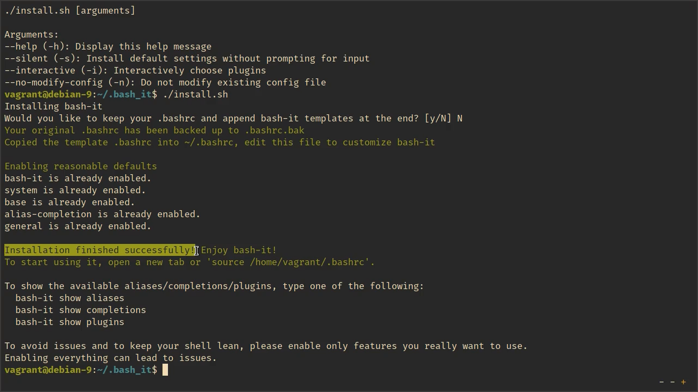
```

最后，我们关闭并重新打开终端（远端机器则注销并重新登录）或者执行下面的命令就可以开始使用 Bash-it 了：

```bash
xiaodong@codeland:~/.bash_it$ source ~/.bashrc
```

#### 查看别名、补全和插件

Bash-it 的 `install.sh` 脚本在默认情况下只会启用少量的别名、自动补全和插件，下面就让我们找出来。

首先，我们来看看启用了哪些别名：

```bash
xiaodong@codeland:~$ bash-it show aliases | less
```

该命令的输出分为 3 列，第一列为别名的名称，第二列显示该别名是否启用（启用的别名在 [] 中有 X），最后一列是有关别名的说明。如图 \@ref(fig:bashit-show-alias) 所示。

```{r bashit-show-alias, fig.cap='在 Bash-it 中查看别名'}
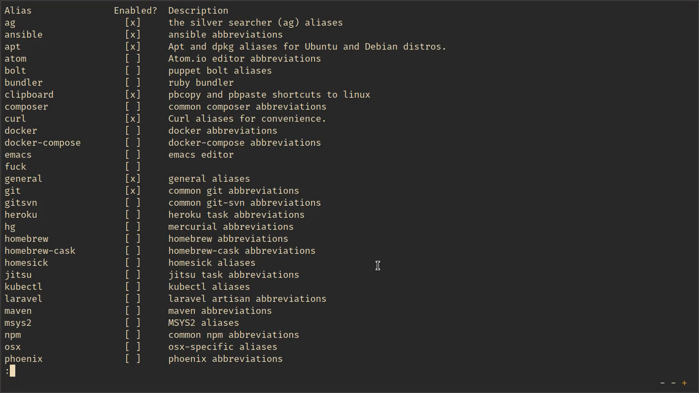
```

在此我们可以看到 Bash-it 启用了 general、apt、ansible 等别名。

接着，我们看看启用了哪些自动补全：

```bash
xiaodong@codeland:~$ bash-it show completions | less
```

我们发现 system、bash-it 等自动补全已经启用了。如图 \@ref(fig:bashit-show-comp) 所示。

```{r bashit-show-comp, fig.cap='在 Bash-it 中查看补全'}
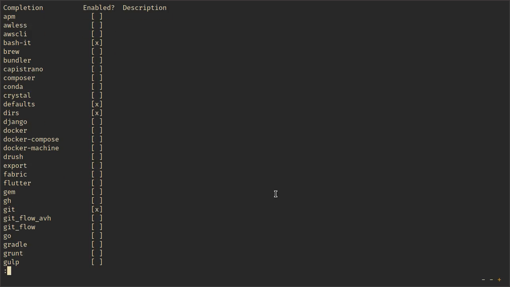
```

最后，我们再看看启用了哪些插件：

```bash
xiaodong@codeland:~$ bash-it show plugins | less
```

在输出中显示 base、alias-completion 等插件已经启用。如图 \@ref(fig:bashit-show-plug) 所示。

```{r bashit-show-plug, fig.cap='在 Bash-it 中查看插件'}
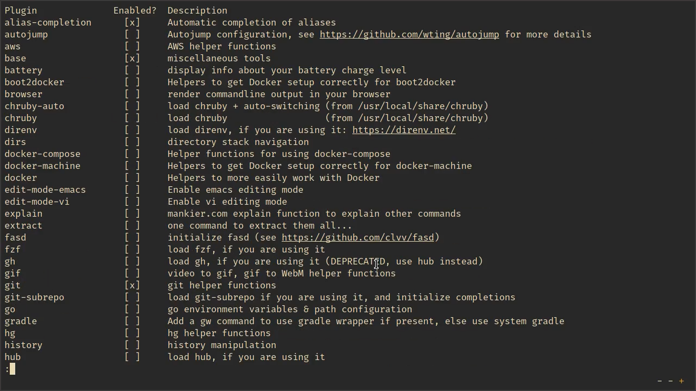
```

#### 搜索内容

除了直接列出所有的别名、自动补全和插件之外，Bash-it 还提供了一个非常快捷的方式来查找所需的内容。比如，我们想要看看有关 tmux 和 ansible 的情况，不妨执行以下命令：

```bash
xiaodong@codeland:~$ bash-it search tmux ansible
    aliases:  ansible tmux
    plugins:  tmux tmuxinator
completions:  tmux
```

从命令输出中我们看到 tmux 的别名、补全和插件都没有启用，而 ansible 的别名已经启用，因为其颜色为绿色。

#### 启用别名、补全和插件

既然 Bash-it 为我们提供了如此丰富的别名、自动补全和插件，那么不用的话就太可惜了。下面，我们就来分别看看如何启用别名、自动补全和插件。

时下非常流行的版本控制系统 Git，相信大家都有过接触和使用。让我们先启用 git 别名：

```bash
xiaodong@codeland:~$ bash-it enable alias git
git enabled with priority 150.
```

Bash-it 为我们回显出启用的结果，并设置优先级 150。

接着，我们执行以下命令：

```bash
xiaodong@codeland:~$ bash-it reload
```

以便让 Bash-it 自动为我们重新载入配置。这样，我们就能够立即开始使用刚才启用的 git 别名。但是，到底有哪些 git 别名呢？别着急，我们可以通过下面的命令了解：

```bash
xiaodong@codeland:~$ bash-it help aliases git | less
```

大致估算一下，Bash-it 提供的 git 别名差不多有近 80 个，实在是非常多。如图 \@ref(fig:bashit-alias-git) 所示。

```{r bashit-alias-git, fig.cap='Bash-it 提供的 git 别名'}
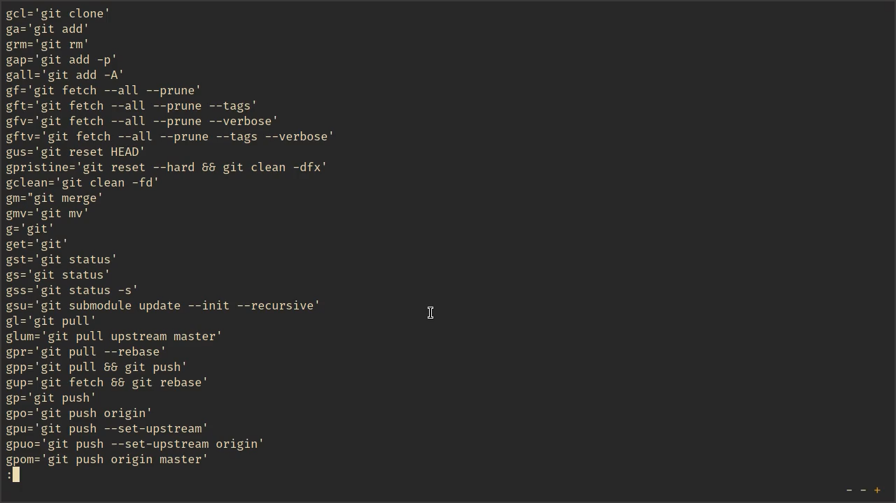
```

最后，我们拿 Bash-it 的源代码目录来验证 git 别名是否生效：

```bash
xiaodong@codeland:~$ cd ~/.bash_it
xiaodong@codeland:~/.bash_it$ gs
On branch master
Your branch is up-to-date with 'origin/master'.
nothing to commit, working tree clean
```

从 `gs` 所显示出的 git 仓库状态，我们可以确信 git 别名一切正常。

再来让我们启用 git 自动补全：

```bash
xiaodong@codeland:~$ bash-it enable completion git
git enabled with priority 350.
```

与启用 git 别名类似，在启用 git 自动补全时，Bash-it 也为其分配了一个优先级 350。

还有 git 插件，我们也将其启用：

```bash
xiaodong@codeland:~$ bash-it enable plugin git
git enabled with priority 250.
```

Bash-it 命令的输出仍然与启用别名和自动补全时相似。

除了通过 `bash-it enable` 命令来启用别名、自动补全和插件外，我们也可以在搜索模块和组件时加以启用。例如：

```bash
xiaodong@codeland:~$ bash-it search git --enable
    aliases:  git gitsvn
    plugins:  autojump fasd git git-subrepo jgitflow jump
completions:  git git_flow git_flow_avh
```

这样，将把包含 git 关键字的所有别名、自动补全和插件全都启用。本例中的 gitsvn、jgitflow、git_flow 也一并启用了。

此外，我们也可以通过下列命令来分别启用所有的别名、自动补全和插件：

```bash
xiaodong@codeland:~$ bash-it enable alias all
xiaodong@codeland:~$ bash-it enable completion all
xiaodong@codeland:~$ bash-it enable plugin all
```

禁用别名、自动补全和插件跟启用时类似，只是把 enable 换成 disable 即可。比如，假设我们想要禁用 gitsvn 别名，则可以执行：

```bash
xiaodong@codeland:~$ bash-it disable alias gitsvn
```

如果禁用成功，Bash-it 命令输出如下结果：

```bash
gitsvn disabled.
```

#### 更改主题

Bash-it 随附了大约 50 多个提示符主题样式，如果想要看看这些主题的真实外观，那么我们可以执行下面的命令：

```bash
xiaodong@codeland:~$ BASH_PREVIEW=true bash-it reload
```

Bash-it 的默认主题为 bobby。要是你不喜欢的话，那么可以将其更改为别的主题。不过，Bash-it 并没有提供相关的更改命令，我们需要直接编辑 `.bashrc` 配置文件。

使用文本编辑器（如 vim）打开 `~/.bashrc`：

```bash
xiaodong@codeland:~$ vim ~/.bashrc
```

然后找到下行内容：

```bash
export BASH_IT_THEME='bobby'
```

将单引号中的内容（bobby）替换成别的主题名称（如 powerline），并保存即可。

为了使新设置的提示符主题生效，你需要关闭并重新打开终端，或者注销并重新登录。如图 \@ref(fig:bashit-theme) 所示。

```{r bashit-theme, fig.cap='Bash-it 提示符主题'}
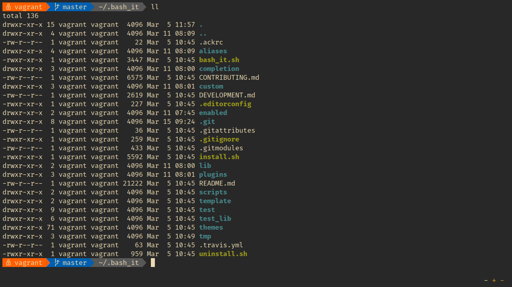
```

#### 定制别名、插件和主题

Bash-it 的确为我们提供了不少好用的别名、自动补全和插件，然而，我们还是有不能满足的时候。为此，Bash-it 提供了一种方便我们进行定制的机制，可以定制的内容包括别名、自动补全、插件、主题样式等等，它们的路径和名称如下：

+ `aliases/custom.aliases.bash`：别名
+ `completion/custom.completion.bash`：自动补全
+ `lib/custom.bash`：库
+ `plugins/custom.plugins.bash`：插件
+ `custom/themes/<theme name>/<theme name>.theme.bash`：主题样式

在此，我们以如何定制别名为例来说明，其它类型的定制方法类似，无非就是以特定的名称命名并放在确定的目录。

首先，我们在 `aliases` 目录下使用文本编辑器（如 vim）创建 `custom.aliases.bash` 文件：

```bash
xiaodong@codeland:~$ cd ~/.bash_it/aliases
xiaodong@codeland:~$ vim custom.aliases.bash
```

接着，添加具体的别名内容：

```bash
alias sd='shutdown -h now'
alias up='uptime'
```

编辑完成后保存。

然后，我们可以利用以下命令来查看：

```bash
xiaodong@codeland:~$ bash-it help aliases
custom:
sd='shutdown -h now'
up='uptime'
```

末尾显示的 custom 正是我们添加的内容。

我们再重新加载一下配置：

```bash
xiaodong@codeland:~$ bash-it reload
```

现在，我们刚刚添加的定制别名就可以开始使用了：

```bash
xiaodong@codeland:~$ up
07:54:08 up  5:23,  1 user,  load average: 0.00, 0.00, 0.00
```

#### 更新 Bash-it

Bash-it 是社区化项目，隔段时间便会增添新的模块和组件，或是修正过往版本中的缺陷。我们可以通过将 Bash-it 更新到最新版本，以保持同步。为了更新 Bash-it，我们可执行以下命令：

```bash
xiaodong@codeland:~$ bash-it update
```

### zsh 配置框架

与 Bash-it 一样，[Oh My Zsh](https://github.com/robbyrussell/oh-my-zsh) 也是开源的社区性项目。在所有的 zsh 配置框架中，Oh My Zsh 算得上是最流行的。Oh My Zsh 包含了许多来自 zsh 社区的好东东，它主要体现在插件、实用的函数、辅助例程、提示符主题样式等方面。

#### 安装 Oh My Zsh

因为 Oh My Zsh 的安装依赖 git 和 curl（或 wget），所以在安装它之前，我们先检查一下系统中是否存在它们：

```bash
xiaodong@codeland:~$ which git curl wget
```

如果以上命令没有返回结果，那么我们需要先把它们安装到系统中。

好了，若是一切准备就绪，现在就可以执行下面的命令来安装 Oh My Zsh：

```bash
xiaodong@codeland:~$ sh -c \
"$(curl -fsSL
https://raw.github.com/robbyrussell/oh-my-zsh/master/tools/install.sh)"
```

安装过程要花一会儿功夫，我们需耐心等待。Oh My Zsh 在安装时将对原来的 `.zshrc` 配置文件备份，若是出现“....is now installed!”的字样时，就说明 Oh My Zsh 安装成功了。如图 \@ref(fig:ohmyzsh-install) 所示。

```{r ohmyzsh-install, fig.cap='Oh My Zsh 安装过程'}
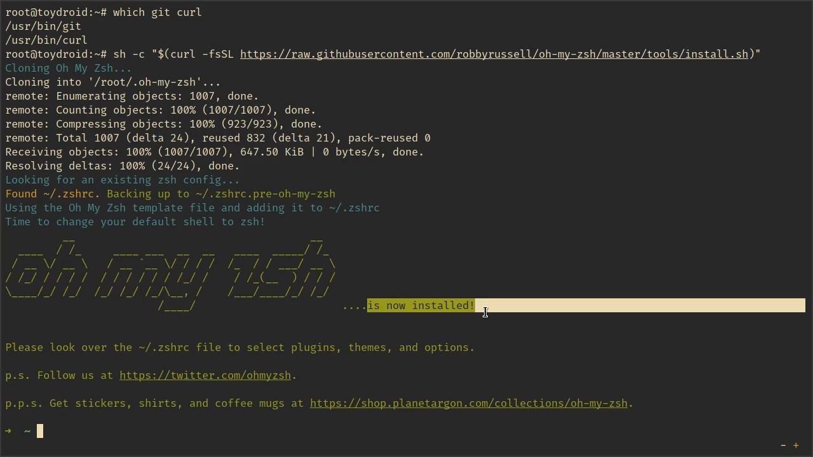
```

#### 启用插件

在安装时，Oh My Zsh 只启用了一个 git 插件。若想用得更舒服，我们就得启用其它插件。对 Oh My Zsh 而言，所谓插件通常包括别名、实用函数、自动补全等内容。在启用其它插件之前，也许你想要了解一下 Oh My Zsh 到底有哪些插件？为此，我们可以转到 Oh My Zsh 安装目录下的 `plugins` 子目录查看：

```bash
xiaodong@codeland:~$ cd ~/.oh-my-zsh/plugins
xiaodong@codeland:~/.oh-my-zsh/plugins$ ls
```

我们可以看到，在 Oh My Zsh 中，每个插件都有一个单独的目录。例如，我们继续进入 `systemd` 目录：

```bash
xiaodong@codeland:~/.oh-my-zsh/plugins$ cd systemd
xiaodong@codeland:~/.oh-my-zsh/plugins/systemd$ ls
```

其下包含 `README.md` 和 `systemd.plugin.zsh` 两个文件。前者为有关该插件的使用说明，而后者为 `systemd` 插件的源代码。如图 \@ref(fig:ohmyzsh-view-plug)。

```{r ohmyzsh-view-plug, fig.cap='Oh My Zsh 插件目录'}
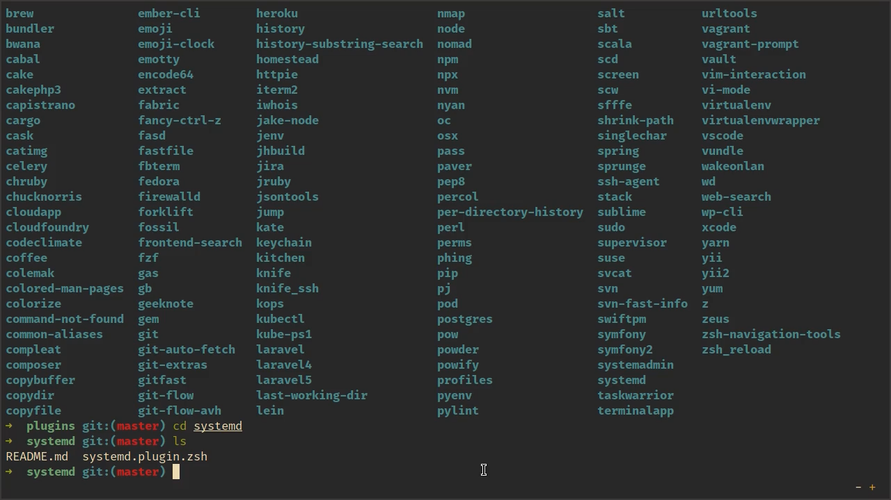
```

另外，我们也可以通过浏览器查看 [Oh My Zsh 的 Wiki 页面](https://github.com/robbyrussell/oh-my-zsh/wiki/Plugins)来了解它有哪些插件。

在知晓了有哪些插件及其插件的用途后，现在我们就来启用插件。我们先使用文本编辑器打开 `.zshrc` 配置文件：

```bash
xiaodong@codeland:~$ vim ~/.zshrc
```

然后找到下行内容：

```bash
plugins=(git)
```

将需要启用的插件追加到 `git` 后面即可。

```bash
plugins=(git colored-man-pages systemd)
```

我们在此启用了 `colored-man-pages` 和 `systemd` 插件。

为了使启用的插件生效，我们还需要执行下面的命令：

```bash
xiaodong@codeland:~$ source ~/.zshrc
```

现在让我们来验证一下启用的插件，如图 \@ref(fig:man) 和 \@ref(fig:systemd) 所示。

```bash
xiaodong@codeland:~$ man zsh
xiaodong@codeland:~$ sc-status sshd
xiaodong@codeland:~$ sc-list-units
```

```{r man, fig.cap='执行 man zsh 的输出结果'}
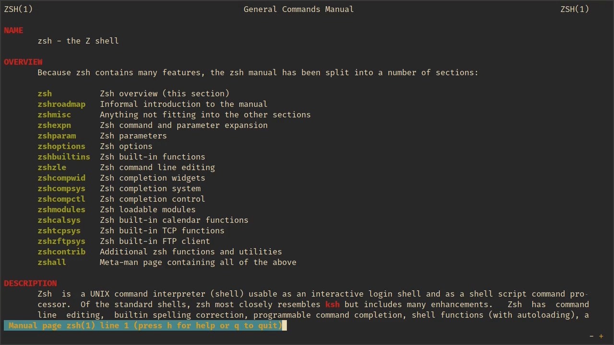
```

```{r systemd, fig.cap='执行 sc-status sshd 的输出结果'}
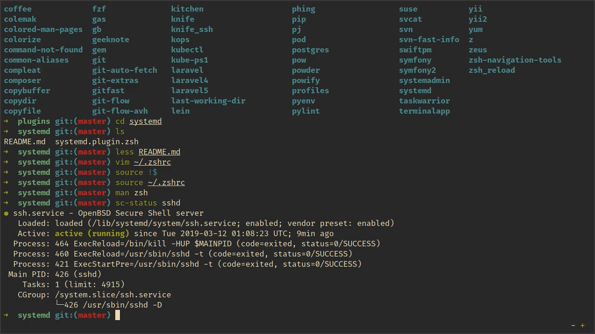
```

#### 更换主题

Oh My Zsh 的默认提示符主题样式是 robbyrussell，若是你不喜欢，那么可以更换成别的主题样式。在 Oh My Zsh 中包含有上百个主题样式，每种主题样式的外观可通过其 [Wiki 页面](https://github.com/robbyrussell/oh-my-zsh/wiki/Themes)查看。

一旦选定了 Oh My Zsh 的主题样式，便可通过编辑 `.zshrc` 配置文件的方式来更换。

```bash
xiaodong@codeland:~$ vim ~/.zshrc
```

在 `zshrc` 文件中找到下面这行：

```bash
ZSH_THEME="robbyrussell"
```

将双引号中的内容替换成另外的主题样式名称（如 simple）。如果你拿不定主意选哪个主题样式，那么不妨将其设置为 `random`。这样，Oh My Zsh 就会为你随机选择一种主题样式。

保存编辑后执行以下命令以便使更改生效，如图 \@ref(fig:ohmyzsh-theme) 所示。

```bash
xiaodong@codeland:~$ source ~/.zshrc
```

```{r ohmyzsh-theme, fig.cap='Oh My Zsh 的 simple 主题样式'}
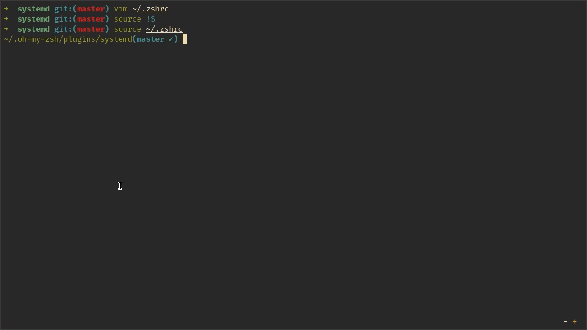
```

#### 定制插件和主题

虽然 Oh My Zsh 已经涵盖了不少插件和主题，但是我们还是有可能去添加一些个性化的东西。直接修改原有内容的方法明显不可取。为了解决这个问题，Oh My Zsh 提供了一个名为 `custom` 的目录。我们只需把要定制的内容保存到 `.zsh` 结尾的文件即可。例如，如果我们打算添加一些新的别名，那么在创建 `myaliases.zsh` 文件后，再加入下列内容：

```bash
xiaodong@codeland:~$ cd ~/.oh-my-zsh/custom
xiaodong@codeland:~$ vim myaliases.zsh
alias sd='shutdown -h now'
alias up='uptime'
```

然后保存编辑结果，并执行：

```bash
xiaodong@codeland:~$ source ~/.zshrc
```

现在我们就可以使用新加的别名了：

```bash
xiaodong@codeland:~$ up
```

类似的，如果要定制插件和主题，它们有专门存放的目录。定制的插件代码需放在以下目录：

```bash
~/.oh-my-zsh/custom/plugins
```

除了我们自己的插件外，这个目录也可以用来安装外部插件。[zsh-syntax-highlighting](https://github.com/zsh-users/zsh-syntax-highlighting) 是一个为 zsh 提供语法加亮的插件，其实现灵感来自于 fish shell。遗憾的是，该插件并没有包含到 Oh My Zsh 中。为了使用它，我们可以把它安装到上述目录：

```bash
xiaodong@codeland:~$ cd ~/.oh-my-zsh/custom/plugins
xiaodong@codeland:~/.oh-my-zsh/custom/plugins$ git clone \
https://github.com/zsh-users/zsh-syntax-highlighting.git
```

然后在 `.zshrc` 配置文件中启用：

```bash
plugins=(<原有插件> zsh-syntax-highlighting)
```

添加 zsh-syntax-highlighting 前，如图 \@ref(fig:synhigh-b) 所示。

```bash
xiaodong@codeland:~$ echo $'hello, world\x21'
```

```{r synhigh-b, fig.cap='未启用 zsh-syntax-highlighting 时'}
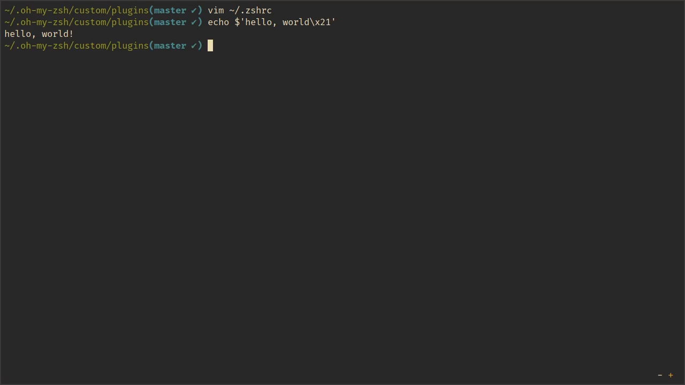
```

启用 zsh-syntax-highlighting 后，如图 \@ref(fig:synhigh-a) 所示。

```bash
xiaodong@codeland:~$ source ~/.zshrc
xiaodong@codeland:~$ echo $'hello, world\x21'
```

```{r synhigh-a, fig.cap='启用 zsh-syntax-highlighting 后'}
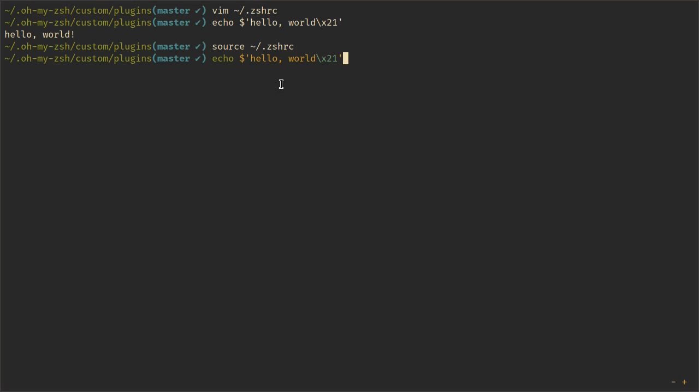
```

此外，要把定制的主题代码放在下面的目录：

```bash
~/.oh-my-zsh/custom/themes
```

#### 其它命令和配置

Oh My Zsh 还带了其它几个有趣而实用的命令。下面简单对其作个介绍：

+ `take`：创建新目录，并转到该目录，而且支持多级目录，如：`take www/oops`
+ `zsh_stats`：列出使用次数最多的 20 个命令，包含使用次数和所占百分比统计，如图 \@ref(fig:zsh-stats) 所示。

```{r zsh-stats, fig.cap='zsh stats'}
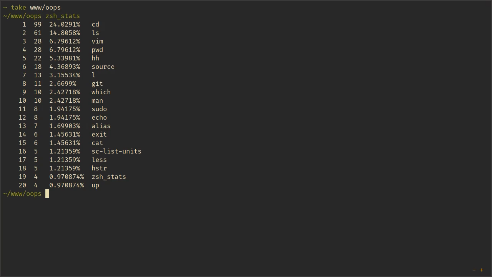
```

此外，Oh My Zsh 也包含其它一些有用的配置，我们可根据自己的需要设置：

```bash
xiaodong@codeland:~$ vim ~/.zshrc

ENABLE_CORRECTION="true" # 启用命令自动纠正
```

#### 获取更新

Oh My Zsh 在默认情况下将每隔几周检查是否有更新。若有更新，则予以提示并进行升级。如果你觉得提示烦人的话，那么可以将其关闭。关闭提示更新的方法是，把下行内容追加到 `~/.zshrc` 配置文件中：

```bash
DISABLE_UPDATE_PROMPT=true
```

我们也可以手动更新 Oh My Zsh，为此，可以执行以下命令，结果如图 \@ref(fig:upgrade-zsh) 所示。

```bash
xiaodong@codeland:~$ upgrade_oh_my_zsh
```

```{r upgrade-zsh, fig.cap='更新 Oh My Zsh'}
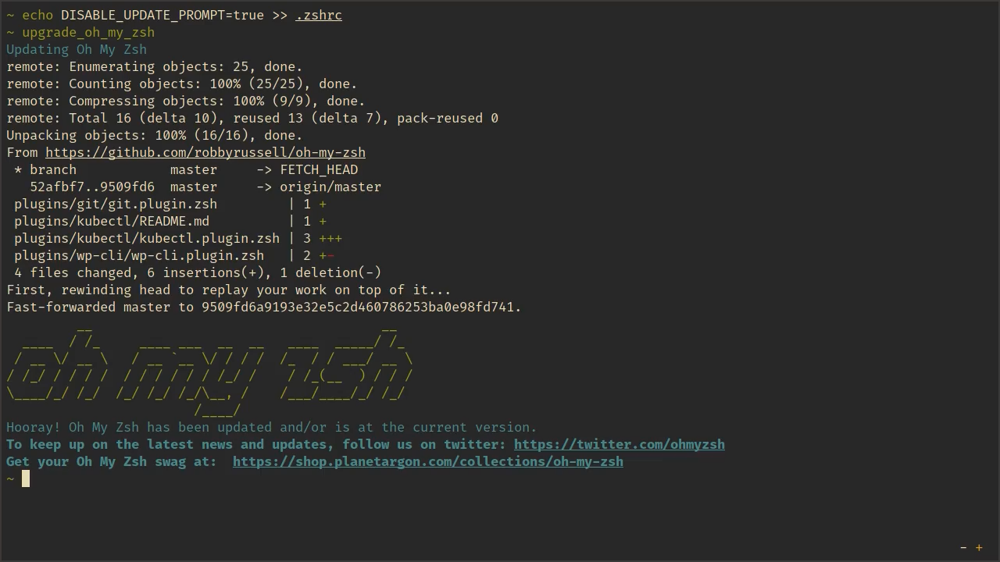
```

## 增强工具

除了像 Bash-it 和 Oh My Zsh 这种大而全的 Shell 配置框架外，市面上也包括一些单独的工具。利用这些工具，我们不仅能够增强 Shell 的功能，而且可以达到更加愉悦的 Shell 使用体验。下面，我们就来介绍既实用又有意思的第三方增强工具。

### 快速路径切换：z.lua

[z.lua](https://github.com/skywind3000/z.lua) 是一个使用 Lua 编程语言实现的类似 z.sh、autojump、fasd 等功能的快速路径切换工具。其特点包括：

+ 对所有访问路径进行跟踪，具备学习功能，使用正则匹配从而能够更加准确的带你到想去的地方；
+ 与 z.sh、autojump、fasd 相比，速度更快；
+ 支持广泛的 shell，包含 bash、zsh、fish 等等。

#### 安装 z.lua

因为 z.lua 是通过 Lua 编程语言实现的，所以在安装它之前，确保我们的系统中已经包含 `lua`。

```bash
xiaodong@codeland:~$ which lua lua5.1 lua5.2 lua5.3
```

z.lua 支持 Lua 5.1、5.2、5.3 以上版本，上述命令只要有一个正确输出便可。

接下来，我们将 z.lua 的源代码克隆到用户主目录的 `~/.z.lua` 子目录：

```bash
xiaodong@codeland:~$ git clone \
https://github.com/skywind3000/z.lua.git \
~/.z.lua
```

待克隆完毕，我们将 z.lua 的初始化语句添加到相应的 Shell 配置文件。

对 bash 来说，将下面这行追加到 `~/.bashrc` 配置文件中：

```bash
eval "$(lua ~/.z.lua/z.lua --init bash)
```

若是 zsh，则添加以下内容到 `~/.zshrc` 配置文件：

```bash
eval "$(lua ~/.z.lua/z.lua --init zsh)
```

另外，我们也可以在 `--init` 选项后面添加 `once enhanced` 参数，以便执行增强匹配模式。我们推荐使用这种匹配模式，从而让 z.lua 更准确的切换到我们想去的路径。

保存编辑后，分别执行下列命令以便使 z.lua 即时生效：

```bash
xiaodong@codeland:~$ source ~/.bashrc # bash
xiaodong@codeland:~$ source ~/.zshrc  # zsh
```

#### 使用 z.lua

z.lua 在安装成功后会创建一个名为 `z` 的别名。让我们先用 `z` 来切换一些目录：

```bash
xiaodong@codeland:~$ z cli
xiaodong@codeland:~/cli$ z ~/prj
xiaodong@codeland:~/prj$ z usingcli
xiaodong@codeland:~/prj/usingcli$ z ~/tmp
xiaodong@codeland:~/tmp$ z ~/.z.lua
xiaodong@codeland:~/.z.lua$
```

在默认设置下，z.lua 将所有访问的路径都保存到了 `~/.zlua` 文件中。我们可以用 `cat` 来查看它的内容：

```bash
xiaodong@codeland:~$ cat ~/.zlua
/home/xiaodong/cli|6|1551946470
/home/xiaodong/.z.lua|3|1551946500
/home/xiaodong/prj|8|1551944681
/home/xiaodong/tmp|3|1551944599
/home/xiaodong/prj/usingcli|1|1551944549
```

从上面命令的输出中，我们可以看到每个访问路径的次数和时间都有记录。它们使用 `|` 分隔。z.lua 正是通过这个访问路径数据库来帮助我们快速切换到想去的目录。

另外，我们也可以直接执行 `z`，这将使 z.lua 列出所访问的路径条目：

```bash
xiaodong@codeland:~$ z
6          /home/xiaodong/.z.lua
12         /home/xiaodong/cli/1.15.8/src/event/modules
12         /home/xiaodong/cli/1.15.8/src/event
16         /home/xiaodong/prj/usingcli
20         /home/xiaodong/cli/1.15.8/src
28         /home/xiaodong/tmp
32         /home/xiaodong/cli
52         /home/xiaodong/prj
```

其中，开头的数字为每个访问路径的权重，该权重由 z.lua 根据算法计算得到。

了解了 z.lua 的基本原理，下面我们就来进行实战：

```bash
xiaodong@codeland:~$ z p
xiaodong@codeland:~/prj$
```

在执行该命令后，z.lua 通过参数 `p` 匹配到了我们先前访问的路径：

```bash
/home/xiaodong/prj
```

并转到了该目录。

我们再来试试：

```bash
xiaodong@codeland:~/prj$ z p us
xiaodong@codeland:~/prj/usingcli$
```

这次，z.lua 将我们带到了下面的目录：

```bash
/home/xiaodong/prj/usingcli
```

在这种情况下，z.lua 必须同时匹配 `p`（匹配 prj）和 `us`（匹配 usingcli），只有两个条件都满足，才会转到相应的目录。

此外，`z` 命令还包含一些选项以实现其它的功能。比如：

+ `-i`：交互模式，如果有多个匹配结果的话，那么 z.lua 将展示一个列表：

        xiaodong@codeland:~$ z -i p
        2:  24         /home/xiaodong/tmp
        1:  48         /home/xiaodong/prj
        >

  从列表中，我们可以看到有两个路径条目，中间列为权重。在提示符 `>` 后输入编号，z.lua 将带我们到相应的目录。直接按**回车键**将不进行跳转。

+ `-b`：这个选项在深层次目录中跳转特别有用，它可以将我们快速带回某一级的父目录：

        xiaodong@codeland:~$ z mod
        xiaodong@codeland:~/cli/1.15.8/src/event/modules$ z -b sr
        xiaodong@codeland:~/cli/1.15.8/src$

  第一次，z.lua 跳转到了以下目录：

        ~/cli/1.15.8/src/event/modules

  在添加 `-b` 选项后，z.lua 根据给定的匹配关键字 `sr` 匹配到了 `src` 这级父目录，并跳转到了该目录：

        ~/cli/1.15.8/src

值得一提的是，z.lua 还支持自动补全。如果我们在执行 `z p` 时按 **Tab 键**，z.lua 则会显示一个列表：

```bash
xiaodong@codeland:~$ z p<Tab>
xiaodong@codeland:~$ z /home/xiaodong/prj
/home/xiaodong/prj  /home/xiaodong/tmp
```

经过一段时间的使用，我们认为 z.lua 确实是相当不错的路径切换工具，每一个使用命令行的用户都应当将其纳入自己的工具箱。

### 高效查询 Shell 历史：HSTR

虽然在 bash 和 zsh 中，我们可以使用 **Ctrl + r** 来搜索历史命令列表，但是它还不够高效。为此，程序员又开发出了比 **Ctrl + r** 更好用的工具：[HSTR](https://github.com/dvorka/hstr)。我们可以把 HSTR 看作 **Ctrl + r** 的增强版本，它使用起来也更加方便。

#### 安装 HSTR

HSTR 支持 bash 和 zsh，其本身是使用 C 编写而成，在使用它之前，我们必须先安装它。HSTR 为常见的 Linux 发行版都提供有二进制包，包括 Debian、Ubuntu、Fedora、CentOS 等等。

在 Debian 和 Ubuntu 中，可按如下方式安装：

```bash
xiaodong@codeland:~$ sudo -i
root@codeland:~# echo -e "\ndeb https://www.mindforger.com/debian \
      stretch main" >> /etc/apt/sources.list
root@codeland:~# wget -qO - https://www.mindforger.com/gpgpubkey.txt \
      | apt-key add -
root@codeland:~# apt update && apt install hstr
```

如果要在 Fedora 和 CentOS 中安装 HSTR，那么可以执行：

```bash
xiaodong@codeland:~$ sudo yum install hstr
```

Arch Linux 可从 [AUR](https://aur.archlinux.org/packages/hstr/) 安装 HSTR。

#### 配置 HSTR

一旦安装完毕 HSTR，我们便可通过 `hstr` 命令来调用它。不过，在此之前，我们需要先对其进行配置。

对 bash 来说，执行以下命令：

```bash
xiaodong@codeland:~$ hstr -s
alias hh=hstr                    # hh to be alias for hstr
export HSTR_CONFIG=hicolor       # get more colors
shopt -s histappend              # append new history items to
                                 # .bash_history
export HISTCONTROL=ignorespace   # leading space hides commands
                                 # from history
export HISTFILESIZE=10000        # increase history file size
                                 # (default is 500)
export HISTSIZE=${HISTFILESIZE}  # increase history size
                                 # (default is 500)
# ensure synchronization between Bash memory and history file
export PROMPT_COMMAND="history -a; history -n; ${PROMPT_COMMAND}"
# if this is interactive shell, then bind hstr to Ctrl-r
# (for Vi mode check doc)
if [[ $- =~ .*i.* ]]; then bind '"\C-r": "\C-a hstr -- \C-j"'; fi
# if this is interactive shell, then bind 'kill last command' to
# Ctrl-x k
if [[ $- =~ .*i.* ]]; then bind '"\C-xk": "\C-a hstr -k \C-j"'; fi
```

```bash
xiaodong@codeland:~$ hstr -s >> ~/.bashrc
```

如果是 zsh，则执行：

```bash
xiaodong@codeland:~$ hstr -z
alias hh=hstr                  # hh to be alias for hstr
export HISTFILE=~/.zsh_history # ensure history file visibility
export HSTR_CONFIG=hicolor     # get more colors
bindkey -s "\C-r" "\eqhstr\n"  # bind hstr to Ctrl-r
                               # (for Vi mode check doc)
```

```bash
xiaodong@codeland:~$ hstr -z >> ~/.zshrc
```

这段配置不仅为 HSTR 定义了别名 `hh`，而且为其绑定了快捷键 **Ctrl + r**。为了使其生效，分别重新载入 bash 和 zsh 的配置文件：

```bash
xiaodong@codeland:~$ source ~/.bashrc
xiaodong@codeland:~$ source ~/.zshrc
```

#### HSTR 的用法

HSTR 已经准备就绪，现在我们可以开始使用它了。有两种启动 HSTR 的方式，一种是执行命令，另一种是按快捷键。下面，我们分别对其进行介绍。

首先，我们来看看如何通过命令的方式来启动 HSTR。前面在配置 HSTR 时，我们为其定义了别名 `hh`。所以我们在命令行直接输入 `hh` 并按**回车键**：

```bash
xiaodong@codeland:~$ cd ~/cli
xiaodong@codeland:~/cli$ hh
```

HSTR 为我们呈现了一个可以交互的文本界面，如图 \@ref(fig:hstr) 所示。该界面大致可以分为 4 个部分，从上往下依次为：

1. 命令输入行：我们输入命令，或者查询关键字的地方。
2. 使用提示行：包含如何使用的说明以及按键的作用。
3. 当前状态行：显示当前视图的排列方式、关键字的匹配方法、以及是否区分大小写等信息。
4. 历史命令列表：根据视图的排列方式展示历史命令。

```{r hstr, fig.cap='HSTR 的界面'}
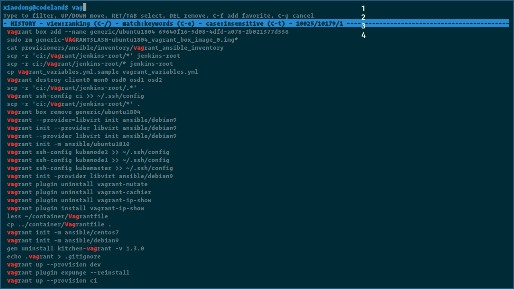
```

让我们在命令输入行输入一些字符看看：

```bash
xiaodong@codeland$ vag # vagrant
```

我们每输入一个字符，HSTR 都会进行搜索，并将列表中匹配的命令用高亮颜色显示。如果输错了，则按**退格键**或**Ctrl + u**删除。然后，再重新输入。

现在，根据我们的需要，我们可以进行如下选择：

+ 直接按**回车键**，这将执行列表中的第一行命令。
+ 如果想要对命令进行编辑，那么我们可以按**Tab 键**。
+ 或者，按**Ctrl + g**取消本次操作。

在执行 `hh` 的时候，我们也可以带一个查询关键字参数。这样，HSTR 启动时就会直接将过滤结果展示给我们，如图 \@ref(fig:hstr-arg) 所示。

```bash
xiaodong@codeland:~/cli$ hh nvim
```

```{r hstr-arg, fig.cap='执行 hh nvim 的结果'}
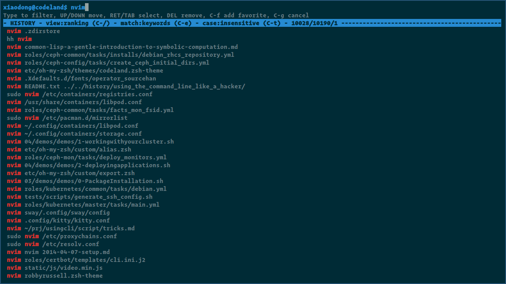
```

除了执行命令外，HSTR 还支持通过快捷键启动。我们只需要按**Ctrl + r**即可。

##### 列表操作

前面我们只提到了如何使用列表中的第一条命令，如果我们想要使用其它命令，那么又该如何操作呢？

首先，在 HSTR 的交互文本界面中，我们可以通过下面的快捷键来上下移动：

+ **下方向键**或**Ctrl + n**：向下移动一行
+ **上方向键**或**Ctrl + p**：往上移动一行

一旦选定某行命令，除了执行我们先前介绍的操作之外，我们还能够将其加入收藏夹，或者删除不再需要的命令。

+ **Ctrl + f**：将命令添加到收藏夹
+ **Delete 键**：删除命令，根据提示按**y**将确认删除

##### 控制选项

在 HSTR 的交互文本界面中，我们可以通过更改它的控制选项，从而改变其行为。HSTR 的控制选项主要包括以下 3 种：

1. 视图排序方式：包含按 HSTR 的排名算法排序、历史顺序、以及收藏夹。按**Ctrl + /**可以在这 3 中视图方式中循环。
2. 匹配方法：包括关键字匹配、精确匹配、以及正则匹配。按**Ctrl + e**可以在 3 中匹配方法中切换。
3. 是否区分大小写：按**Ctrl + t**进行切换。

随着对 HSTR 的使用次数越多，我们越感觉 HSTR 确实是很棒的工具。对于想要追求操作效率的各位读者来说，一定不要错过。
